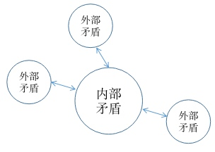
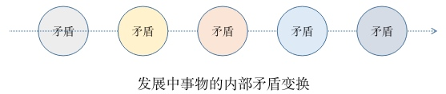
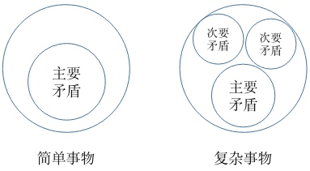
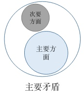
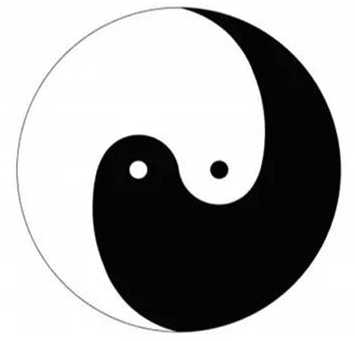
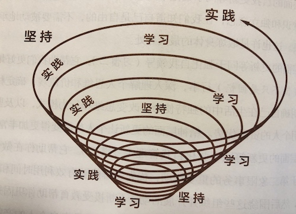
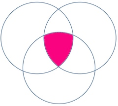

# 辩证法

## 为什么要读《实践论》和《矛盾论》

人生无论工作还是生活，其实就是不断处理问题的过程，解决问题的好坏代表其能力大小。毛泽东作为开创新中国一个时代的代表人物，意味着他解决问题的能力是顶尖的。而其背后哲学思想的核心就是《实践论》和《矛盾论》，国外友人曾说，毛泽东是解构矛盾的大师，那么有理由相信，当我们真正掌握了其方法，对我们解决工作中的问题有莫大帮助。

《实践论》和《矛盾论》其实就是方法论和认识论，也是我们常说的辩证法，是辩证唯物论的核心。

希望大家都去看看两篇文章，需要反复阅读理解。如果有精力通读毛选更好。

## 矛盾是核心

矛盾存在一切事物的发展过程中，没有矛盾就没有世界。

问题就是因为有矛盾的存在，否则不会成为问题。因此解决问题首先要学会分析矛盾，只有充分了解矛盾分析矛盾，然后才有能解决问题。

矛盾分为内部矛盾和外部矛盾，唯物辩证法的观点是：事物因内部矛盾引起发展。

单纯的外部原因，只能引起事物量上的变化，不能引起事物质的变化，并且，即时引起事物量的变化，也要通过事物内部的内部矛盾，外部原因只是间接作用。

接下来进一步了解内部矛盾。

## 矛盾的普遍性

前面说充分了解事物的内部矛盾后才能解决问题，那么解决问题后，矛盾还存在吗？当然存在，只是矛盾进行了转化，表现就是旧的问题解决了，新的问题必然会产生。

这就是矛盾的普遍性，它有两方面的含义：

1. 矛盾存在一切事物的发展过程中；
2. 每一事物的发展过程中存在着自始至终的矛盾运动；

新问题产生的原因，是因为内部矛盾的形态发生了转化。

所以，世界的万事万物都存在矛盾，一旦矛盾不存在了，该事物必然消亡。矛盾不是一成不变的，正是矛盾的不断转化才促使事物的发展。

## 矛盾的特殊性

任何运动形式，其内部都包含著本身特殊的矛盾。这种特殊的矛盾，就构成一事物区别于他事物的特殊的本质。这就是世界上诸种事物所以有千差万别的内在的原因。

想要研究矛盾，首先要研究个体事物的内部矛盾，就是其特殊矛盾，这是它区别于其他事物的本质。然后研究多个事物特殊矛盾的共性，用总结出来的共性指导新事物内部矛盾的研究，如此循环。

## 矛盾的普遍性和特殊性的关系

矛盾的普遍性和矛盾的特殊性的关系，就是矛盾的共性和个性的关系。

其共性是矛盾存在于一切过程中，并贯串于一切过程的始终，矛盾即是运动，即是事物，即是过程，也即是思想。

共性是绝对性。然而这种共性，即包含于一切个性之中，无个性即无共性。一切个性都是有条件地暂时地存在的，所以是相对的。

这一共性个性、绝对相对的道理，是关于事物矛盾的问题的精髓，不懂得它，就等于抛弃了辩证法。共性是绝对的，个性是相对的，意味着个性可以进行转化。

## 主要的矛盾和矛盾的主要方面

任何过程如果有多数矛盾存在的话，其中必定有一种是主要的，起着领导的、决定的作用，其他则处于次要和服从的地位。捉住了主要矛盾，一切问题就迎刃而解。

而矛盾中的诸方面，发展是不平衡的，平衡只是暂时的，基本形态是不平衡的。必然也是一方面是主要的，起主导作用，事物的性质，主要地是由取得支配地位的矛盾的主要方面所规定的。

## 矛盾诸方面的同一性和斗争性

一切矛盾着的东西，互相联系着，不但在一定条件之下共处于一个统一体中，而且在一定条件之下互相转化，这就是矛盾的同一性的全部意义。

同一性是有条件的，相对的，但是矛盾的斗争性贯串于过程的始终，并使一过程向着他过程转化，矛盾的斗争无所不在，所以说矛盾的斗争性是无条件的、绝对的。

有条件的相对的同一性和无条件的绝对的斗争性相结合，构成了一切事物的矛盾运动。

太极图由正反两面组成，是统一的一体，其中正反两面相互斗争、联结、转化。

太极图画出的是矛盾处于平衡的时刻。不平衡时，矛盾中的一方会占主导作用。如白方占主导时，必定是由黑方向白方转化的结果。物极必反、盛极必衰，当白方充盈到一定程度后，必然会向黑方转化，否则会导致一方消失，那么矛盾的载体就会消亡。事物的矛盾斗争的存在是绝对，不存在斗争时则事物消亡。

白中有黑，黑中有白，代表矛盾两方的同一性，是可以相互转化的基础。

## 实践论的核心思想

有了矛盾论作为思想指导，但是具体如何做呢？实践论给了我们最科学的方式，具体如下图：

辩证唯物论的认识论三个阶段：感性认识、理性认识、实践验证。

从感性认识而能动地发展到理性认识，又从理性认识而能动地指导革命实践，改造主观世界和客观世界。实践、认识、再实践、再认识，这种形式，循环往复以至无穷，而实践和认识之每一循环的内容，都比较地进到了高一级的程度。这就是辩证唯物论的全部认识论，这就是辩证唯物论的知行统一观。

## 用辩证法分析学不懂的原因

如果你之前没有接触过辩证法，相信此刻仿佛打开新的思想大门，激动不已，同时又掺杂着迷茫，因为还是不清楚如何使用理论的武器。

过几天之后，再回头来看，其理论已经不能引起你的兴奋。因为你发现这都是纯理论，说的都对，但和空谈貌似区别也不太大。（想想当初分享《提升认知》的场景，是不是很相似）

为什么？（大家讨论……）

通过上面的螺旋上升图就可以解答这个问题。对一个事物的认知，是必须要经过实践检验的。至于不知道如何实践的问题，有两种可能性：第一种可能就是毛主席说的，是个懒汉，不喜欢实践；第二种可能就是，理论知识还未消化，无法指导实践。

人很容易陷入一个误区：认为听明白就算学会了。因此不愿意在上面再花时间。

或者你去实践了，依然没有入门，这是正常情况，必须经过不停反复的过程才能真正掌握知识。

从矛盾的普遍性和特殊性上也可以解答这个情况：要达到应用知识的程度，必然清楚其矛盾的特殊性和普遍性，普遍性从特殊性中来，所以首先要了解其特殊性，从单一事物的特殊性中分析共性，然后将共性应用到另单一事物的分析中，再分析其单一事物的特殊性。整个过程中但凡出现一点儿不对应的情况，就必须重新来过。

## 绝对与相对等理论的应用

绝对性、相对性、同一性、斗争性，这些名词有很大魔力，要善于运用。

在《提升认知》中我们说过，人类永远也无法完全理解世界。所以首先要明白一个道理：没有纯粹的绝对性。那么为什么还要提绝对性这个概念呢？因为要扩大对世界的认知必须要有基石，必须要有绝对性。但是任何绝对性都是以相对为前提的，也就是绝对性必有前提条件。

首先圈定一个范围，然后在这个范围内就可以建立绝对性，依据绝对性建立知识理论体系的大厦，这个范围就是前提条件。

辩证法的前提条件是：

1. 世界是普遍联系的；
2. 世界是永恒发展的；

有了绝对性我们才有依据分析未知问题。

矛盾的斗争是绝对性的，知道这个有什么用呢？例如我们要分析团队的问题，先确认团队这个概念是否被圈定在这个绝对性范围之内？符合，则进入下一步。

依据矛盾斗争的绝对性，我们知道团队中永远会存在矛盾，除非团队消亡。因此可以推论出：解决团队中某个问题，必然会引起其他问题。这就是绝对性，不以人的意志为转移。

假如认知仅仅到这一步，可能会产生消极的思想，既然矛盾永远消除不掉，那还何必努力呢？这个时候相对性和同一性就来解救了。

矛盾虽然不会消除，依据同一性，主要矛盾和次要矛盾可以转化，把团队中不能忍受的问题可以转化为次要矛盾，主要矛盾中的主要方面可以转化为次要方面，转化后可能都感受不到它的存在。

再回到绝对性上，团队中的问题不可能全部消除掉，所以当发现问题时，一定要思考这个问题在矛盾中的地位，需不需要解决，解决后会引来什么新问题。如果是次要矛盾的次要方面，其实是无需解决的。团队管理者，切记不要发现问题就着急去解决，说不定是解决小问题激化了大问题。

同一性告诉我们，没有任何事情是不可以解决的。绝对性告诉我们，没有任何事情可以完全解决的，除非它消亡了。

## 绝对性更进一步的应用

通过绝对性可以推论出绝对的结论，所以绝对性是很好的解决问题的工具。尽量掌握多的绝对性理论，然后分析各个绝对性的范围和关系，当分析新问题时，尽量将问题拉到多个绝对性的交集中，通过多个绝对性的窄门，从不确定的事物中发现确定性的规律。

人类本身一直就在不确定的世界中寻找相对确定的规律。

## 关于实践的一点心得

上面提到学习知识的难处通常在于实践，所以单独提一下实践的问题。

首先，学习的知识很难有实践环境的话，尽量不学。学了必然不深，很容易忘，和等用到知识时再学差距不大，没必要浪费时间。同时，充分利用好工作带来的福利，人生三分之一的时间都在工作，都在处理问题，这是实践的最大来源，要充分利用好。

其次，过去人生的经历也是宝贵的，新知识，也可以用过去的经历路线去验证，其中还有个好处是，经历已经有了结果，可以迅速得出结论，不必等待，而且不必再花费机会成本。

最后，很难实践的知识，可以用思想实验的方式，很多学科都采用了思想实验。即便有实践的机会，思想实验也可以减少实践路径，降低实践成本。

