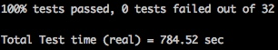
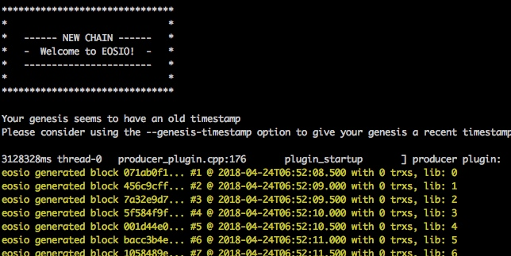
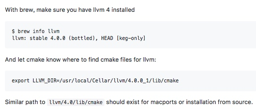
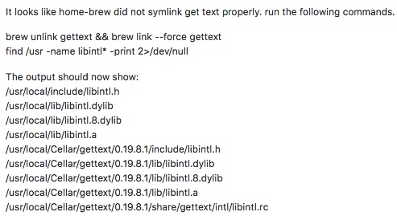

# EOS开发环境搭建


## 编译环境要求

MacOS Darwin 10.12及以上版本（推荐10.13.x）
```
8GB空闲内存
20GB空闲磁盘
```

我的编译环境：

```
macOS 10.13.3 (17D47)
xcode 9.3 (9E145)
16GB内存
256GB固态硬盘
```

## 下载源码并编译

编译步骤官网列的很清楚，看[这里](https://github.com/EOSIO/eos/wiki/Local-Environment#autobuild)

#### 下载源码：

```
git clone https://github.com/EOSIO/eos --recursive
```

因为EOS包含了一些子模块，所以需要加`--recursive`参数，它的意思是自动更新仓库中的子模块。

#### 下载源码完毕后，开始编译：

```
cd eos
./eosio_build.sh
```

编译过程会比较长，请耐心等待。如果没有出错，会出现下面界面，代表编译成功：


```
    EOS.IO has been successfully built. 0:0:54 

    To verify your installation run the following commands: 

    /usr/local/bin/mongod -f /usr/local/etc/mongod.conf & 
    export PATH=${HOME}/opt/mongodb/bin:$PATH 
    cd /Users/hong/eos/build; make test 

    For more information: 
    EOS.IO website: https://eos.io 
    EOS.IO Telegram channel @ https://t.me/EOSProject 
    EOS.IO resources: https://eos.io/resources/ 
    EOS.IO wiki: https://github.com/EOSIO/eos/wiki 

```

#### 验证环境

根据提示，执行：

```
/usr/local/bin/mongod -f /usr/local/etc/mongod.conf &
```

`mongod`是mangodb数据库（也就是说eos数据存储采用了mangodb），`-f`指明用哪个配置文件启动mongodb，后面是配置文件的路径。`&`意思是后台启动，不打断我们当前终端的使用。

可通过`ps -ef | grep mongod`查看是否已经启动mongodb，正常启动会显示mongod的进程：

```
501 25178     1   0 11:20AM ??         3:52.69 /usr/local/bin/mongod -f /usr/local/etc/mongod.conf
```

执行测试用例：

```
cd build
make test
```

最终给出测试结果：




#### 安装可执行程序

```
sudo make install
```

可执行`nodeos --help`看是否安装成功。


## 运行EOS测试节点


```
nodeos -e -p eosio --plugin eosio::wallet_api_plugin --plugin eosio::chain_api_plugin --plugin eosio::account_history_api_plugin 
```

如果看到下面的界面，就说明eos单节点启动了：




## 编译过程中的问题


#### 问题1:Could not find a package configuration file provided by "LLVM"

```
CMake Error at libraries/wasm-jit/Source/Runtime/CMakeLists.txt:26 (find_package): 
  Could not find a package configuration file provided by "LLVM" (requested 
  version 4.0) with any of the following names: 

    LLVMConfig.cmake 
    llvm-config.cmake 

  Add the installation prefix of "LLVM" to CMAKE_PREFIX_PATH or set 
  "LLVM_DIR" to a directory containing one of the above files.  If "LLVM" 
  provides a separate development package or SDK, be sure it has been 
  installed. 
```

为方便观看，使用贴图：


最后在eos的github issues找到答案，详情看[这里](https://github.com/EOSIO/eos/issues/43)

具体解决方法：




#### 问题2：Linking CXX executable cleos

```
[ 97%] Linking CXX executable cleos 
Undefined symbols for architecture x86_64: 
  "_libintl_bindtextdomain", referenced from: 
      _main in main.cpp.o 
  "_libintl_gettext", referenced from: 
      eosio::client::localize::localized_with_variant(char const*, fc::variant_object const&) in main.cpp.o 
      eosio::client::localize::localized_with_variant(char const*, fc::variant_object const&) in help_text.cpp.o 
  "_libintl_setlocale", referenced from: 
      _main in main.cpp.o 
  "_libintl_textdomain", referenced from: 
      _main in main.cpp.o 
ld: symbol(s) not found for architecture x86_64 
clang: error: linker command failed with exit code 1 (use -v to see invocation) 
make[2]: *** [programs/cleos/cleos] Error 1 
make[1]: *** [programs/cleos/CMakeFiles/cleos.dir/all] Error 2 
make[1]: *** Waiting for unfinished jobs.... 
[ 99%] Built target chain_test 
make: *** [all] Error 2 
```

还是github上找到答案：[这里](https://github.com/EOSIO/eos/issues/2028)




## 附录

编译过程中，可以看到eos依赖了很多第三方库：

```
    Checking dependencies. 
    Checking automake ...          automake found 
    Checking Libtool ...          Libtool found 
    Checking OpenSSL ...          OpenSSL found 
    Checking llvm ...          llvm found 
    Checking wget ...          wget found 
    Checking CMake ...          CMake found 
    Checking Boost ...          Boost needs updating.. 
    Checking GMP ...          GMP found 
    Checking gettext ...          gettext found 
    Checking MongoDB ...          MongoDB found 
    Checking Doxygen ...          Doxygen found 
    Checking Graphviz ...          Graphviz found 
    Checking LCOV ...          LCOV found 
    Checking Python3 ...          Python3 found 
```


