# EOS的账户系统


eos包含了三个核心组件：

```
nodeos  区块链节点
cleos   客户端，用来和区块链节点和管理钱包的组件交互
keosd   钱包管理组件
```

三者之间的关系可以用下图表示：

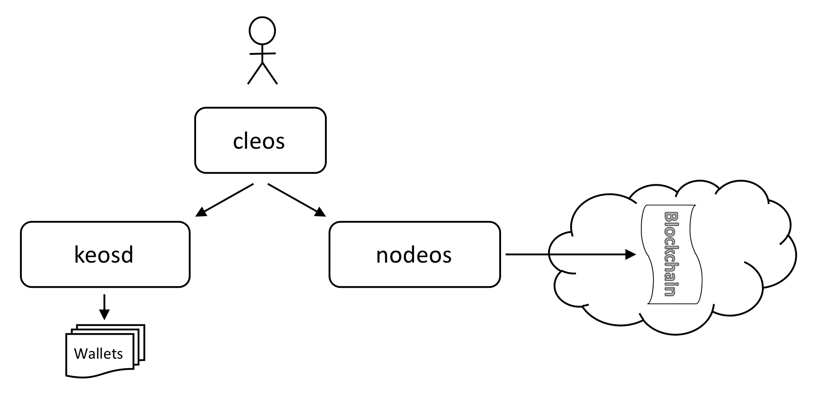


[上一篇]()我们用了一长串命令启动了nodeos，是个本地测试节点：

```
nodeos -e -p eosio --plugin eosio::wallet_api_plugin --plugin eosio::chain_api_plugin --plugin eosio::account_history_api_plugin
```

eos大量采用了插件机制，所以这句命令的意思是启动nodeos节点，名字叫eosio，同时加载三个插件。

```
-e 启动块生产
-p 指定了节点名称
--plugin 指定加载插件
	wallet_api_plugin  使用nodeos管理钱包（nodeos每次关闭是都会把wallet锁定，下次必须重新解锁，才能使用钱包，加锁是加密，解锁是解密）
	chain_api_plugin
	account_history_api_plugin
```

运行起来就是下图的样子：

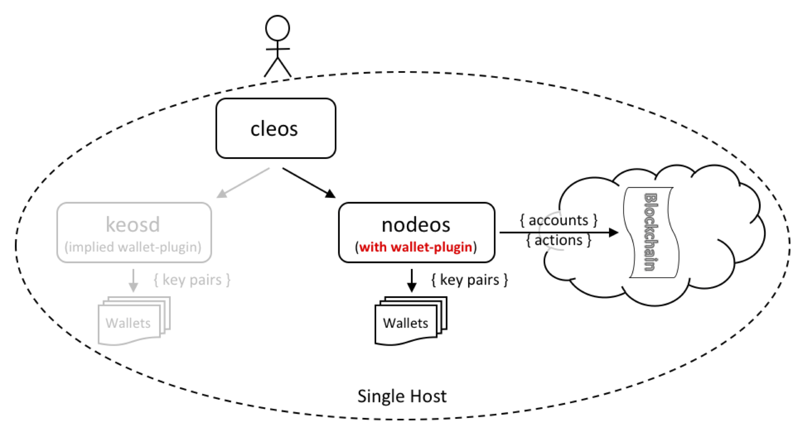

可以发现钱包没有挂载keosd下，而是nodeos下（从侧面证明架构设计的灵活性）。如果挂载到keosd下，需要单独启动keosd服务，因此，测试模式下采用本种方式比较方便。但官方建议正式环境最好不要这么做，从钱包角度考虑不太安全。

观察控制台，可以发现nodeos正常启动并开始生产块了：

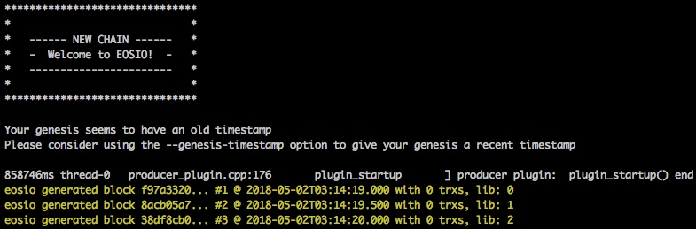


怎么不停的生产块（0.5秒生产一个块）？又没有任何交易，怎么和以太坊不太一样？作为mac用户，我急切的想知道生产的块放到哪里了，避免浪费我的磁盘，看启动日志：

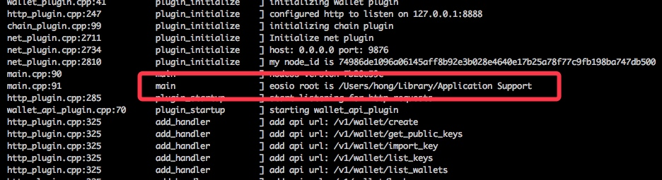

于是找到默认生成目录（若想自己指定路径，使用--data-dir参数）：

```
~/Library/Application Support/eosio/nodeos
```

该目录下有两个文件夹：`config`、`data`:

```
.
├── config
│   ├── config.ini
│   └── genesis.json
└── data
    ├── blocks
    │   ├── blocks.index
    │   └── blocks.log
    ├── default.wallet
    ├── hong.wallet
    └── shared_mem
        ├── shared_memory.bin
        └── shared_memory.meta
```

通过文件夹及文件名称大概也能猜出来是干嘛的，不过现在我们先不管它，后面再详细了解。

通过`du -sh 上面的目录`可以看到存储一直再增加。

> 为了不让它一直生产块，先不加`-e`参数。


## 账户系统

eos的账户系统比以太坊要丰富许多。

在eos中，账户不再仅仅是一个地址，是具有可读性的名字，并且支持命名空间。用户与账户之间的关联同样通过公私钥，账户保存公钥，用户保存私钥，用户通过私钥访问账户，因此私钥的安全由用户保障。


> 账户存在区块链上。

作为普通用户来说，正确的保管私钥不事件容易的事。并且用户直接访问区块链需要很高的技术能力，所以一般用户不会直接访问区块链，而是通过钱包。


这样用户只需要保管好钱包就可以了，也就是说钱包是用户的入口，一个钱包可以管理多个账户。

> 钱包不在区块链上，在本地。

到目前为止，eos和以太坊没有什么区别。下面看看eos独有的特性：

eos账户有权限的概念。因此，eos账户可以是独立的个体，也可以是隶属于某一组织下的个体，并赋予不同权限。这个不难理解，权限体系其实是为了更好的描述现实社会的层级关系。

另一点是eos账户名称支持命名空间，比如`@domain`这个帐户的拥有者是唯一可以创建`@user.domain`帐户的人。

## 账户权限

eos账户权限默认分为：

1. owner  最高权限，可以执行一切操作
2. active  可以执行转移资金，投票等
3. 自定义，继承自active

这是权限组，不是用户，用户隶属于这些权限组，看下官方示例：

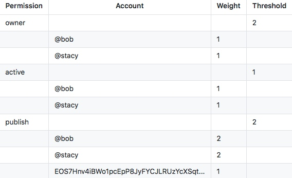

所有帐户都有一个可以做所有事情的“owner”权限组，和一个除了更改所有者组之外可以执行所有操作的“active”权限组。其他权限组均派生自“active”权限组。

拥有owner权限的有两个账户：@bob、@stacy。owner权限的阈值（Threshold）为2，也就是说执行owner权限时，必须达到阈值2时才会授权执行。因为@bob和@stacy每个人的权重都是1，所以要执行owner权限，必须两人都同意才行，类似于董事会投票决议。

## 消息

消息就是账户与账户之间的沟通语言，每个账户都可以发送结构化的消息给任意其他账户，每个账户都可以定义处理消息的脚本，每个账户还有自己的私有数据库，消息处理脚本也可以给其他账户发消息，最终，消息和消息处理脚本组成了EOS的智能合约。


## 实际操作

cleos是eos的客户端，使用起来比较简单，如果不确定如何使用命令，可直接输入关键字自动返回帮助信息，如想知道钱包都有哪些操作，可输入`cleos wallet`，自动返回钱包相关操作：

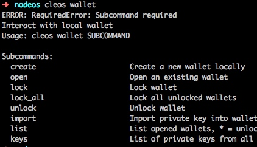


1 先创建一个钱包，如果不给钱包命名的话，默认钱包名称为`default`，可通过`-n`参数来指定钱包的名称：

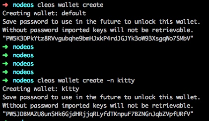

创建钱包时会返回一个钱包的密码，这个密码要保存好，操作钱包需要用到。

2 查看钱包：

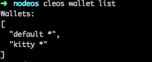

> 钱包名称后面带*号的都是未锁定的账号

3 打开钱包，同样不指定钱包名称则打开默认钱包：
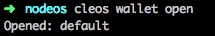

4 解锁钱包（会提示输入密码，就是创建账户时返回的密码）：

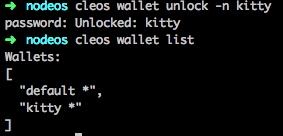


5 创建两个key，一个用于owner，一个用于active：

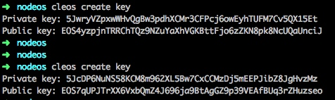


6 创建账户，四个参数分别为：创建者、账户名称、owner公钥、active公钥：

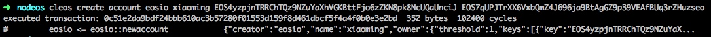

思考一下创建者为什么是`eosio`，它是从哪儿来的？

eosio通过启动参数确定的`producer name`。也可通过config.ini配置文件配置。

7 查看账户信息：

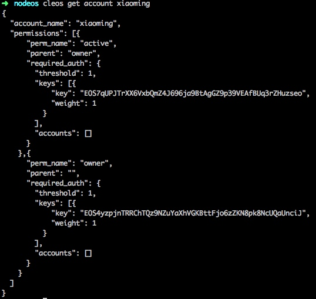


8 钱包导入私钥：

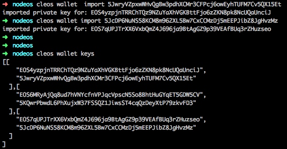

9 get servants导致eos崩溃不可用（必须清除本地节点数据才可恢复，可能是bug）：
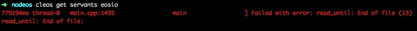


合约相关操作，后续再研究……

