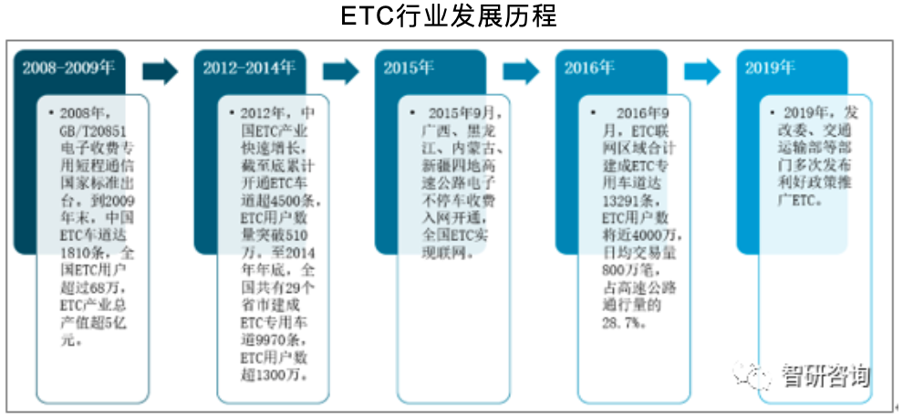
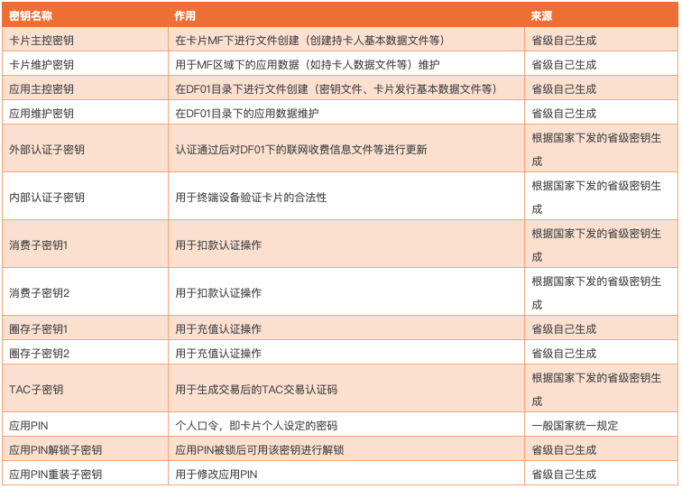

# ETC基础知识


## etc的历史




路网中心：交通运输部路网监测与应急处置中心（2012年7月18日）。


中国路网地址：http://www.chinahighway.org.cn/chinahighway/

收费公路联网结算管理中心：路网中心下设机构。


## 联网总体架构


收费类型：


## etc车道组成


ETC三大技术：

1. 车辆自动识别技术（Automatic Vehicle Identification Systems--AVI）
2. 自动车型分类技术（Automatic Vehicle Classification Systems-AVC）
3. 违章车辆抓拍技术（Video Enforcement Systems-VES）

ETC三大组成部分：

1. 车载单元OBU；
2. 路侧单元RSU；
3. DSRC协议；

#### OBU的组成：


#### RSU的组成：


RSE：路测设备

#### 通信协议

专用短程通信：DSRC（Dedicated Short Range Communications）

```
5.8 GHz被动式微波通信，中等通信速率（500Kbps 上行，250 Kbps下行），调制方式为ASK和BPSK。
输出功率：300 mW 
传播距离：10 m

```


新型通信协议：C-V2X（Cellular-vehicle to everything）

## etc车道通信

RSU中的PSAM卡和OBU中的ESAM/ICC通过DSRC短波通讯操作。


流程图：


## etc安全

PSAM（Payment Security Access Module）消费安全访问模块
ESAM（Embedded Security Access Module）嵌入式安全控制模块


#### 国家级秘钥


#### 省级秘钥


>>> OBU中密钥皆为国家级定义，用户卡中既有国家级也有省级定义密钥

卡存储结构，以用户卡为例：


#### 双向认证

PSAM卡与ICC是一对多的关系。

同一OBU设备如何认证多张卡？

由于直接对暗号存在不安全的隐患，所以密码学中并不直接判断两个密钥是否相等？而是采取一次一密的情况。

```
1、每次都由一方产生一个随机数
2、双方都用密钥计算随机数得到一个值
3、比较随机数的计算值是否相等
```

CPU卡外部认证步骤：

```
1、CPU卡产生一个8字节随机数送给外部程序，CPU卡临时保存随机数在卡内。
2、外部程序把8字节随机数送给机具，机具用密钥计算随机数，得到8字节随机数密文。
3、外部程序把8字节随机数密文送给CPU卡。
4、CPU卡在卡片内部解密8字节随机数得到随机数明文。
5、CPU卡在卡片内部把解密后的随机数和步骤1中临时存放的随机数比对。若相等，则外部认证成功
```

机具内部认证步骤：

```
1、机具产生一个8字节随机数送给外部程序，机具临时保存随机数在机具中。
2、外部程序把8字节随机数送给CPU卡，CPU用内部认证密钥计算随机数，得到8字节随机数密文。
3、外部程序把8字节随机数密文送给机具。
4、机具解密8字节随机数得到随机数明文。
5、机具在内部把解密后的随机数和步骤1中临时存放的随机数比对，若相等，则内部认证成功
```

这样机具和CPU卡从而达到了双向认证


#### 秘钥分散算法

密钥分算算法简称Diversify，是指将一个双长度(一个长度密钥为8个字节)的主密钥(MK)，对数据进行分散处理，推导出一个双长度的DES加密密钥(DK)。该算法广泛应用于现在的金融IC卡和其他对于安全要求高的行业。其DK推导过程如下：

```
推导DK左半部分的方法是：
1、将分散数据（分散因子）的最右8个字节作为输入数据；
2、将MK作为加密密钥；
3、用MK对输入数据进行3DES运算，得到DK左半部分。

推导DK右半部分的方法是：
1、将分散数据的最右8个字节求反，作为输入数据；
2、将MK作为加密密钥；
3、用MK对输入数据进行3DES运算，得到DK右半部分
```

最后将DK的左右部分各8个字节合并成双长度的DK密钥，即为分散所求得的待使用的3DES密钥。

MAC，即报文鉴别码，按照如下的方式使用单重或三重DES加密方式产生MAC。

#### CPU卡秘钥：




#### OBE-SAM秘钥：


#### PSAM卡秘钥：


## 发卡：一发二发

OBU生命周期：


一发主要内容：

1. 替换秘钥
2. 更新系统信息文件：发行方标识、协议类型、版本、合同号等

二发主要内容：

1. 更新车辆信息：车牌号、车牌颜色、车型、车辆用户类型、车辆尺寸、车轮数、车轴数、轴距等
2. 更新系统信息文件：合同签署日期、合同过期日期等
3. 激活OBU

#### 一发流程：


#### 二发流程：


## etc为什么不可拆卸

一车一卡一标签

## 无感支付

将ETC无感支付应用到其他领域：如停车场、加油站等。

“无感支付”技术面临的真正挑战或许是如何防止利用假牌、套牌、跟车等的逃费行为。目前行内也有一些应对方法，比如结合车牌、车型、车身颜色、车内摆件等特征识别技术，而且准确率达到了较高的水平。现阶段，技术不会是问题，不同利益主体，不同支付模式的融合协作，才是问题。

## 附录

#### 名词解释：


```
ESAM = OBE-SAM +  …… 
ESAM、PSAM、ISAM的关系： 
ESAM：采用集成电路芯片封装，焊接在电子标签内部电路板上。 
PSAM：安装在控制器内，用户相关数据的安全计算。 
ISAM：用于用户储值操作，安装在ICC读写设备中。 
```

#### etc部级规范

高速公路区域联网不停车收费示范工程技术要求  22 
https://www.doc88.com/p-2943967614870.html?s=rel&id=3

第一部分：秘钥管理规则 
第二部分：关键设备 检查及送检要求 
https://ishare.iask.sina.com.cn/f/19706720.html

第三部分：清分结算系统 
http://www.doc88.com/p-0199359773672.html

第四部分：PSAM卡应用指南 
http://www.doc88.com/p-2856743498325.html

第五部分：关键信息编码规则 
https://wenku.baidu.com/view/b20cba3d87c24028915fc394.html

第七部分：OBE_SAM安全模块技术要求 
http://www.doc88.com/p-4512083249059.html

第八部分：基于DSRC的etc交易互操作规范 
https://www.doc88.com/p-6012085319321.html

第九部分：非现金支付卡交易流程规范 
http://www.doc88.com/p-2856743498997.html

第十部分：OBU初始化编程器技术要求 
https://www.doc88.com/p-3897905120480.html

第十二部分：RSU与车道控制器的接口 
http://www.doc88.com/p-1993062333547.html

第十三部分：短程通信测试方法 
https://www.doc88.com/p-9032693823460.html

十四：ICC测试规范
十五：OBE_SAM安全模块测试规范 
十六：PSAM卡测试规范
十七：IC卡读卡器测试规范
十八：etc专用标志标线设置要求 
十九：省内数据接口规范 
二十：跨省数据接口规范 
二十一：关键参数管理要求 
二十二：省清分计算中心间报表格式 

ETC用户卡数据规范：
https://max.book118.com/html/2017/0702/119641047.shtm

ETC交易IC卡操作说明： 
https://wenku.baidu.com/view/02bbac3c10661ed9ad51f3a5.html


