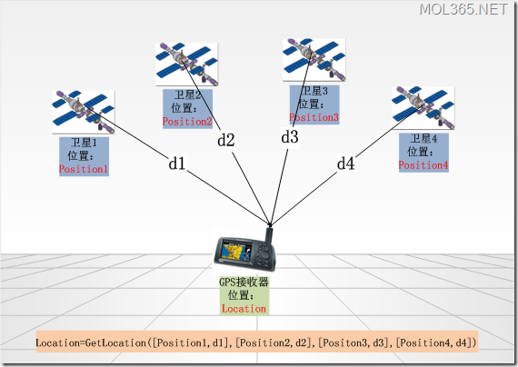
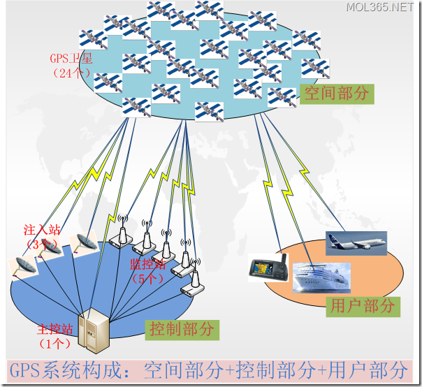
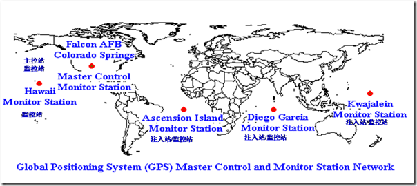

# GPS及其坐标系统

## 什么是GPS

GPS，全称为Global Positioning System，即全球定位系统。

GPS的目的：

GPS起始于1958年美国军方的一个项目，主要目的是为陆海空三大领域提供实时、全天候和全球性的导航服务，并用于情报搜集、核爆监测和应急通讯等一些军事目的，经过20余年的研究实验，耗资300亿美元，到1994年，全球覆盖率高达98%的24颗GPS卫星星座己布设完成。

GPS定位原理：

每一个GPS卫星都在不辞辛劳地广播自己的位置，那么在发送位置信息的同时，也会附加上该数据包发出时的时间戳。GPS接收器收到数据包后，用当前时间（当前时间当然只能由GPS接收器自己来确定了）减去时间戳上的时间，就是数据包在空中传输所用的时间了。知道了数据包在空中的传输时间，那么乘上他的传输速度，就是数据包在空中传输的距离。

为了计算用户的三维位置和接收机时钟偏差，至少需要接收来自4颗卫星的信号，如下图：



GPS系统的构成：



> 其中21颗工作卫星，3颗备用卫星。24颗卫星运行在6个轨道平面上，运行周期为12个小时。

	•	主控站：从各个监控站收集卫星数据，计算出卫星的星历和时钟修正参数等，并通过注入站注入卫星；向卫星发布指令，控制卫星，当卫星出现故障时，调度备用卫星。
	•	监控站：接收卫星信号，检测卫星运行状态，收集天气数据，并将这些信息传送给主控站。
	•	注入站：将主控站计算的卫星星历及时钟修正参数等注入卫星。 


分布情况：



	•	主控站：位于美国科罗拉多州（Calorado）的法尔孔（Falcon）空军基地。
	•	注入站：阿松森群岛（Ascendion）,大西洋；迭戈加西亚（Diego Garcia）,印度洋；卡瓦加兰（Kwajalein），东太平洋。
	•	监控站：1个与主控站在一起；3个与注入站在一起；另外一个在夏威夷（Hawaii）,西太平洋。


全球有四大卫星定位系统：

1. 中国的北斗卫星导航系统（BDS）
2. 美国全球定位系统（GPS）
3. 俄罗斯格洛纳斯卫星导航系统（GNSS）
4. 伽利略卫星导航系统（GSNS）

上面说的是美国全球定位系统。

## 地理坐标系

有了GPS系统就可以进行定位了，但进行三维立体定位，就需要一个三维坐标系统，三维坐标系统就需要有坐标中心点。

```
旋转椭球面的标准方程：

(x2+y2)/a2+z2/b2=1

a即赤道半径，b即极半径，f=(a-b)/a称为扁率。
```

对地球进行三维建模，以地球质心为中心的坐标系，称为`地心坐标系`。

地图是给一个国家服务的，那么这地图就要尽可能描述准确这个国家的地形地貌，尽量减小误差。人为的把地球的质心“移走”，将局部的表面“贴到”该国的国土，使之高程误差尽量减小到最小。这种坐标系称为`参心坐标系`。

常用坐标系：

1. 北京54坐标系（参心） 相当于前苏联1942年坐标系的延伸 
2. 西安80坐标系（参心）该坐标系的大地原点设在我国中部的陕西省泾阳县永乐镇 
3. WGS84坐标系（地心）是为了解决GPS定位而产生的全球统一的一个坐标系
4. CGCS2000坐标系（地心）CGCS2000的定义与WGS84实质一样。基本可以忽略差异

WGS84坐标系就是上面美国GPS系统采用的坐标系，而CGCS2000坐标系是中国北斗采用的坐标系。


## 投影坐标系统

有了地理坐标系统，GPS就可以进行立体定位了。但是还有一个问题，定位后的数据我们经常显示在平面上（如地图），而非立体球面上。如果要将定位坐标与平面结合，需要将地理坐标系转换为平面坐标系，这个转换过程就是`投影`（地图做投影变换）。

常见投影坐标系：

1. 高斯克吕格（Gauss Kruger）投影=横轴墨卡托（Transverse Mercator）投影
2. 墨卡托（Mercator）投影
3. 通用横轴墨卡托（UTM）投影
4. Lambert投影
5. Albers投影
6. Web Mercator（网络墨卡托）投影


## 火星坐标系

由于我国出于安全考虑，中国国家测绘局规定所有GPS坐标需要经过加密，经过加密后的坐标系统称之为`火星坐标系（GCJ-02）`，也叫国测局坐标系，一般是由WGS84坐标系经加密后的坐标系。

而百度坐标系，是对GCJ-02坐标再次加密后的坐标系。其他国内地图也有可能像百度一样做二次加密运算，因此互相不能转换。

再次梳理一下国内常用坐标系：

1. WGS84坐标系：即地球坐标系（World Geodetic System），国际上通用的坐标系。设备包含的GPS芯片或者北斗芯片获取的经纬度一般都是为WGS84地理坐标系，目前谷歌地图采用的是WGS84坐标系（中国范围除外）。
2. GCJ02坐标系：即火星坐标系，国测局坐标系。是由中国国家测绘局制定。由WGS84坐标系经加密后的坐标系。谷歌中国和搜搜中国采用的GCJ02地理坐标系。
3. BD09坐标系：百度坐标系，GCJ02坐标系经加密后的坐标系。bd09ll表示百度经纬度坐标，bd09mc表示百度墨卡托米制坐标。

从设备获取经纬度（GPS）坐标：
```
如果使用的是百度sdk那么可以获得百度坐标（bd09）或者火星坐标（GCJ02),默认是bd09
如果使用的是ios的原生定位库，那么获得的坐标是WGS84
如果使用的是高德sdk,那么获取的坐标是GCJ02
```

互联网在线地图使用的坐标系:

```
火星坐标系：iOS 地图、Google国内地图、搜搜、阿里云、高德地图、腾讯
百度坐标系：百度地图
WGS84坐标系：国际标准，谷歌国外地图、osm地图等
```

一句话：从国内行货设备中获取的坐标基本都是火星坐标，从国内地图上获取的坐标基本都是火星坐标或对火星坐标进行二次加密的坐标。


