# HTTP网络协议

理解一件事物，需先把握其脉络，然后细入表里，实践相随。本篇尝试从基础概念表达脉络及理念。

## 分层思想

分层是软件设计中非常棒的软件架构风格，在设计的各个层次都有应用。

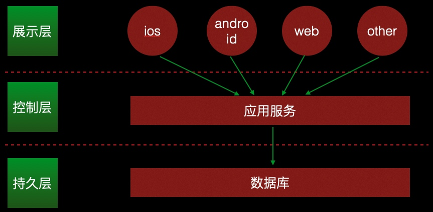

分层其实是一种分而治之的思想，将复杂问题分成若干个独立的子问题，子问题可以再次划分。分层的过程就是解耦的过程，层次好坏就是功能是否独立，所谓的高内聚。

## 标准化

标准化的最大好处就是可以完全复用、节省成本。

表准化与分而治之合起来应用，简直无敌。现今应用软件开发这么容易就是沾了这两个的光，先将软件分层，然后把层次标准化，再把标准实现，普通的开发人员只需要写业务代码就可以了。

java在后端领域独领风骚，是因为其生态比较好。它的生态为什么比其他语言好？因为它制定了标准。同样，任何一个行业要想结束乱象，必须制定标准。

## ISO七层网络协议

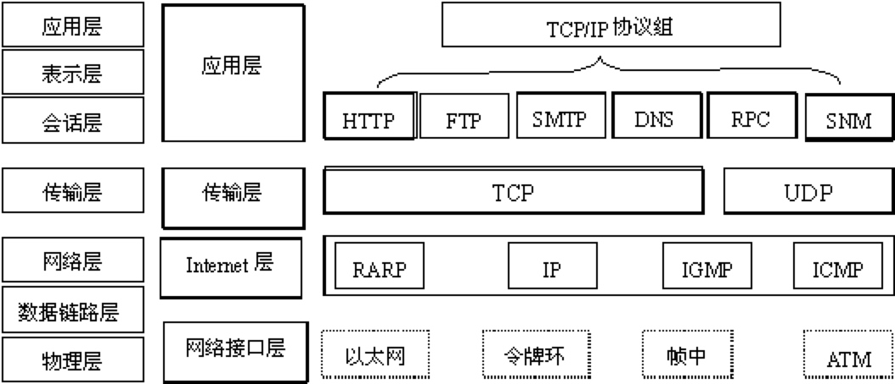

ISO网络协议就是分层和标准化的典范，我们只关心自己需要的层，而无需关心其他层，但是了解相邻层有助于我们更好的理解当前层的运作方式。

UDP: 无连接的网络报文，并发发送，无法确认网络包可到达，无法确认网络包收到的先后顺序。

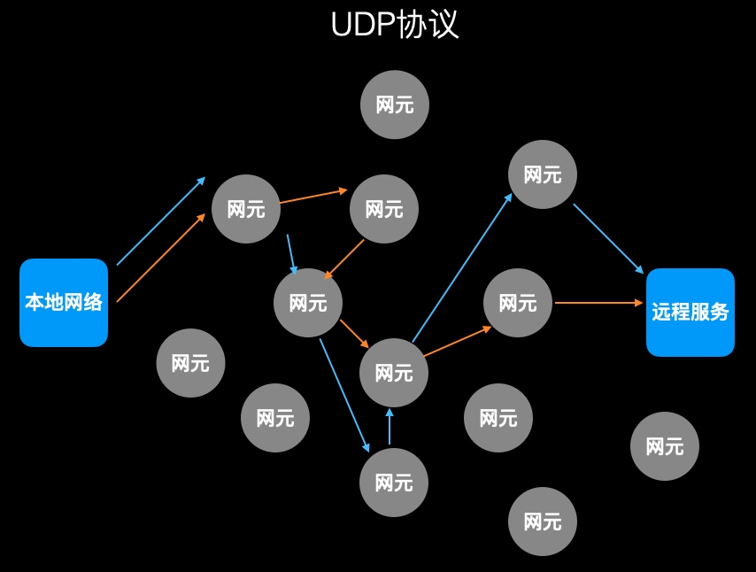

TCP: 面向链接的可靠网络协议。首先要进行网络链接，打通网络虚拟链路，然后保持该链路，确认网络包的到达及接受顺序。

TCP需要先建立虚拟链路，因此不像UDP直接发送数据，而是先经过三次握手建立链路，然后才能发送数据。建立链接的成本比较大，因为需要通信双方来回交互数据三次才能建立链接。

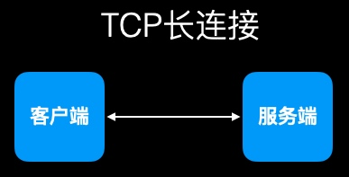

TCP链路如何保持连接不断链：心跳。
TCP是单链路双向传输数据，并且不关心发送的数据类型，都按照二进制数据对待。

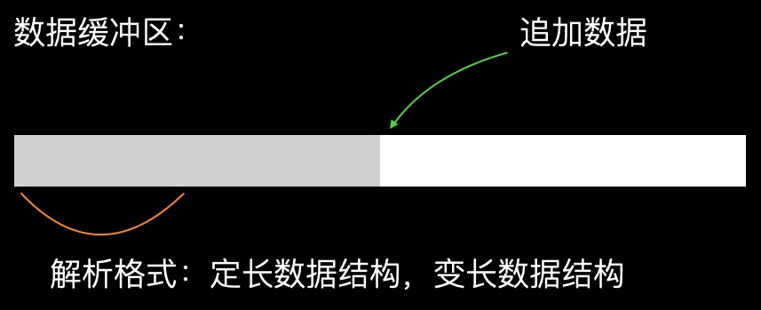

那么问题来了，同一链路发送所有消息，如何判断消息类型，消息数据的长度以及当前是否完整的消息包？

TCP可以发送json数据吗？如何发送？（参考文本编码章节）

HTTP：发送数据只能由客户端发起。

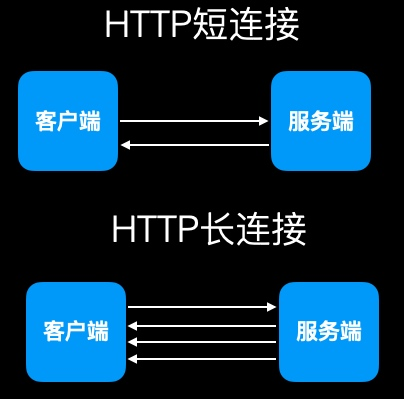

HTTPS：

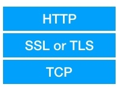

大小端（CPU架构）：

大端存储模式：数据的低位保存在内存的高地址中，数据的高位，保存在内存的低地址中。
小端存储模式：数据的低位保存在内存的低地址中，数据的高位，保存在内存的高地址中。

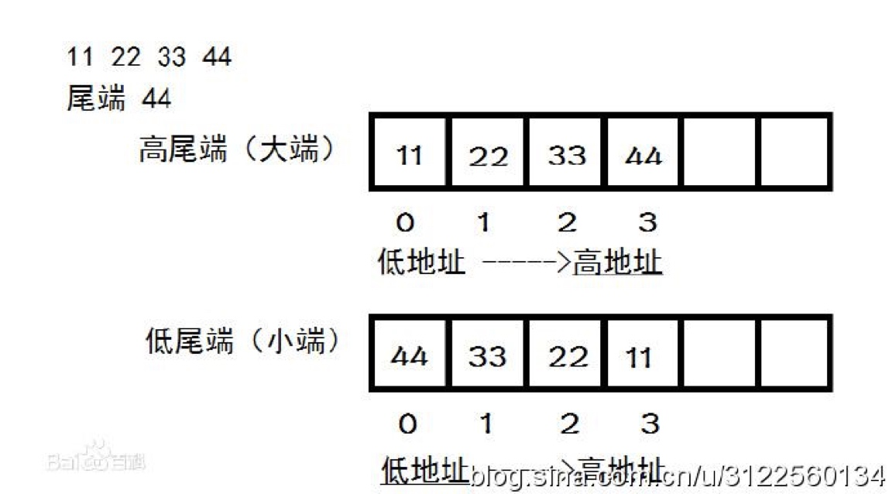

大小端和网络协议有什么关系？CPU架构不同会读错网络传输的数据，存储类型大于byte的都会受影响。

解决方案：

网络数据发送时，先将本地数据统一转换成网络字节序，接收端接收到数据后再转换成本地字节序。

## 自己实现简单的 http 协议

本质：使用 socket 发送文本协议

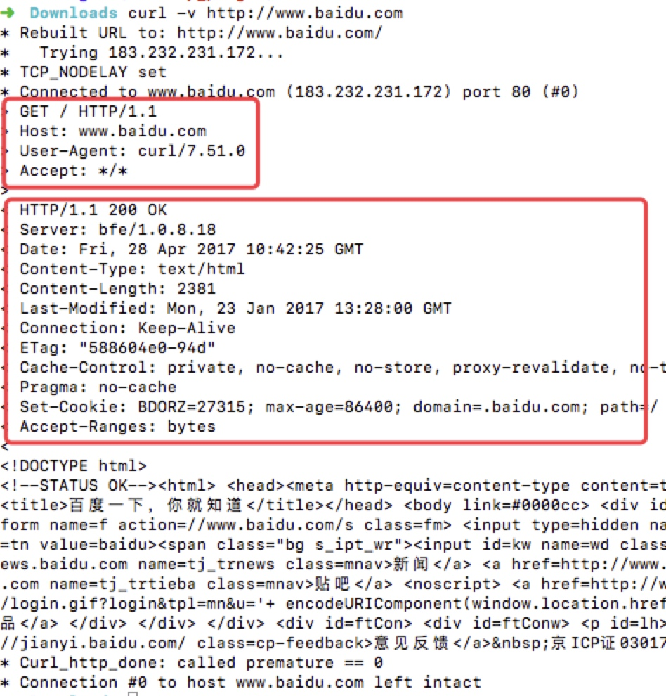

为什么http采用文本协议？

推荐书籍《HTTP权威指南》

## HTTP基础概念

资源：所有能够提供web内容的东西都是web资源。

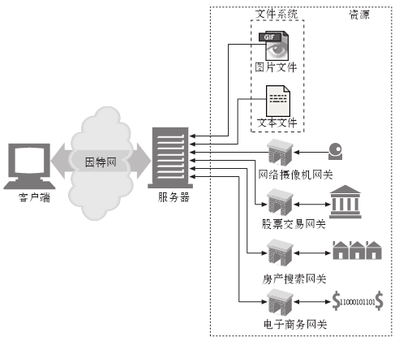

媒体类型：资源多种多样，通过传输的数据要告诉对方是什么数据类型。

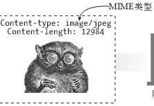

URL：统一资源定位符，用来定位资源所在的位置，方便对资源进行操作。

方法：操作资源的方式。

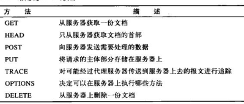

通过URL定位资源，通过方法来操作资源，通过Header、Body、URL参数来确认操作的细节。

1. URL参数是获取（GET）时的操作细节
2. Body是新增（POST）或修改（PUT）时的操作细节
3. Header是HTTP层的控制手段（非业务层），因此在Header中可修改字段值，但不要自定义字段

返回码：对资源操作的结果。

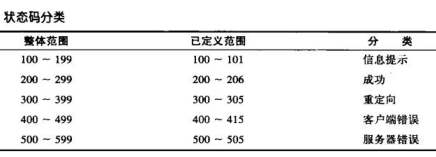

通过上面几个概念体会设计理念，再去看什么是RESTFUL风格，有什么优势。

## HTTP Header

HTTP协议给用户暴露的控制操作，全部规定在Header中，因此对Header的学习就是对HTTP协议本身的学习。

简单了解HTTP1.0 和 1.1版本的区别。

cookie：

1. cookie

缓存相关：

1. expires					过期时间
2. Cache-Control			缓存控制方式
3. If-Modified-Since	条件缓存控制
4. Etag						缓存标签
5. If-None-Match			缓存标签控制方式

长连接：

1. conntection
2. keep-alive

内容协商：

1. Accept              媒体类型
2. Accept-Language     语言
3. Accept-Charset      字符集
4. Accept-Encoding     字符编码

其他消息头：

1. Content-Type			媒体类型
2. Content-Length			内容长度
3. Content-Language    内容语言
4. Content-Encoding    内容编码
5. Content-Location    备用地址
6. Content-Range       实体范围
7. Last-Modified       最后更改时间
8. Allow						该资源允许的请求方法
9. User-agent          用户代理
10. Location				重定向
11. Referer					来源
12. x-forward-for      代理IP
13. x-real-ip				设备IP
14. host						主机地址
15. server					服务器信息

## 综合应用

提升技能成长一个关键环节，就是学会理论分析，即面对一个问题，预先用已有的理论知识对其进行全面分析，分类整理列出问题的所有可能性，针对每种可能性进行排查确认的方法是什么，并针对每种可能性有大致的解决方案。

示例：访问一个网页比较慢，怎么分析其慢的原因？

## 练习题

1. 用socket创建客户端，与web服务简单交互
2. 用socket创建简单web服务接口，用客户端工具HTTP访问
3. 用http实现简单的断点续传功能（分段下载http服务器上的大文件）
4. http服务器如何知道本地网络(浏览器)的外网ip？
5. http服务如何知道客户端发来数据的长度？
6. 为什么会有url编解码的存在？
7. http如何追踪不同网站之间的跳转关系的？
8. user-agent的使用场景？
9. http1.0 、 http1.1  、http2协议之间的区别
10. 什么是dns劫持？一般如何防止？
11. 服务端如何控制客户端缓存周期的？
12. keep-Alive的作用及应用场景？

