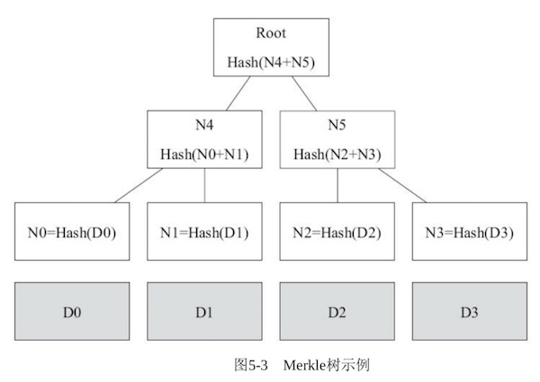

# Merkle Tree浅析

## 完整性校验

关于文件或数据的完整性前面已经提过，通常采用hash值比对来校验的。例如文件下载的校验一般采用md5：下载网站提供某文件下载，并提供原始文件的md5值，你下载文件后计算md5值，并和下载网站提供的md5值比较，看是否一致，如果不一致说明在文件下载过程中被篡改了。数据被篡改可能会引起数据及计算机安全问题。

为什么你从下载网站下载的数据会被篡改呢？为了加快下载速度，文件会被分成多个小块，并且所有文件块都会就近获取（也就是说数据不是全部从指定网站下载的）。那么获取数据块这个环节就存在被替换的风险。

假设我们下载了一个2G的文件，进行md5后发现和原始数据不一致，说明被篡改了。关键是下一步我们该怎么做呢？好吧，你已经知道了，删除文件，然后重新下载，直到确认文件没有被篡改为止。

也许你已经发现其中的问题，因为我们不知道哪个数据块被篡改，所以必须把整个文件丢弃掉。假设只有一个数据块被篡改，理论上只需要重新下载一个数据块就好。现在对整个文件有md5校验，那么可不可以对每个文件块都做校验呢。

## Merkle Tree校验

Merkle Tree就是这种应用场景的一种数据结构。它是由计算机科学家 Ralph Merkle提出的，因此已他的名字命名。

Merkle Tree是由一系列hash值组成的树，二叉树只是其中一种典型应用（可以是多叉），如下图：

现在每个数据块都有一个hash值，作为Merkle Tree的叶子节点，他们的父节点是相邻两个兄弟节点组成的新的hash值，最终根节点（root）代表所有数据的hash值。

这种表示法有几点好处：

1. 即能校验所有数据块，又能直接校验整个文件
2. 当某数据块被篡改时，可以通过根节点往下溯源，找到具体是哪块被篡改
3. 每层的hash值也被校验，如果某节点hash被篡改也会被发现

## 应用场景

除了上面说的数据分块传输，还有区块链采用了Merkle Tree保证账本无法篡改，另外Git版本控制系统也采用它来跟踪文件的变化。

Merkle Tree同样可以用于零知识证明。所谓零知识证明类似于：你如何向买房人证明这套房子属于你的，但又不把买房人带进房内的问题。比如可以当着买房人拿出钥匙开门，或拿出房产证给买房人看。对应Merkle Tree应用原理（按上图），假设N1、N4和Root的hash是公开的，那么你提供N0正确的hash值，就代表你拥有D0的数据，而不必把D0拿出来给他人看。

