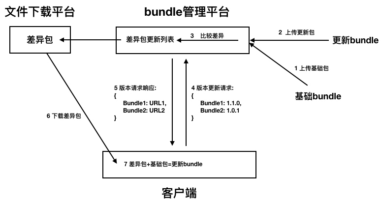
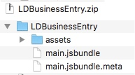
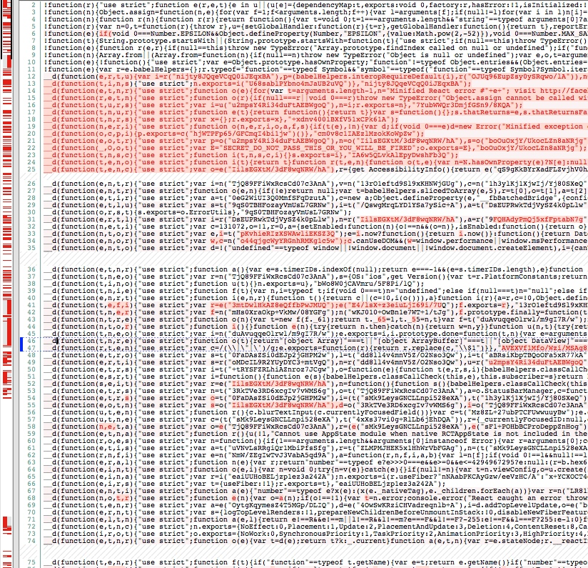
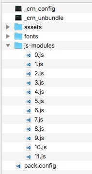
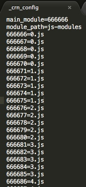
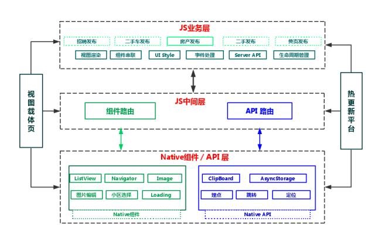
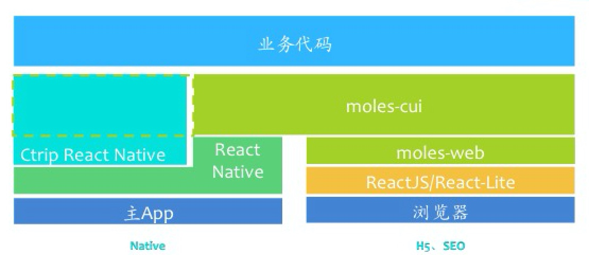

# React Native增量更新技术方案


先放出开源地址： [LDReactNativeDiffUpdate](https://github.com/xuwening/LDReactNativeDiffUpdate) ，目前客户端代码相对稳定，已上线应用，后端代码只完成文件上传、差异匹配及版本更新。

***正是还有很多不足，所以需要大家参与，还等什么：***

* QQ交流群：**539533937**  <a target="_blank" href="//shang.qq.com/wpa/qunwpa?idkey=310cb3000d666c23a0f3757a9d2a3548f0a83aecf2121a214790f96718f07157"></a> 


开源的目的：

目前业界还没有一款足够适应大部分增量更新场景的方案，要么不支持多业务入口，要么没有开源，要么没有开放后台源码。基于这些需求，我们想通过开源社区的力量，大家一起打造出比较完善易用的增量更新框架，因此，需要大家的参与及支持，为RN的生态系统做点儿小贡献。

假如你愿意为React Native生态做出点贡献，欢迎加入一起交流。

## 设计原则

- 增量更新功能比较独立，变更需求不多，因此采用native实现，暂时没有暴露js控制接口
- 在已有项目中应用，需要支持多业务入口
- 为保证客户端体验，业务bundle需客户端内置
- 设计要相对简单，使用方便，适应中小型项目
- 为保证逻辑的简单性，运行时更新UI非核心需求，设定下次启动App更新生效
- 模块要独立，不依赖具体工程，支持gradle及cocoaPods

流程图：




描述：

1. 以一个独立业务为例，上线前需将业务bundle客户端内置，并作为基础bundle上传到bundle管理平台；
2. 当需要在线对bundle进行更新时，将更新bundle（全量）上传bundle管理平台，bundle管理平台根据版本号匹配对应的基础bundle，然后对两者比较差异，输出差异包到文件下载平台，并更新版本bundle列表；
3. 客户端启动时发送版本更新请求，并获取需要更新bundle列表及文件路径；
4. 客户端下载最新bundle差异包，并和内置bundle合并，完成差异更新；

## 客户端实现

客户端本地缓存目录结构：


* 根目录：`rn_res`
* 每个业务一个独立目录，这里有两个业务：`LDRNDefault`和`LDRNTest`
* 每个业务有四个子目录：`origin`、`patch`、`merge`和`index`
* 每个业务有入口文件`main.jsbundle`和资源文件夹`assets`

四个子目录的主要作用：

`origin`:客户端内置bundle的解压目录，也是加载默认main.jsbundle目录
`index`:最新bundle目录，客户端首先加载该目录下的main.jsbundle，如果不存在则加载origin目录下的
`patch`:差异包的下载目录
`merge`:基础bundle与差异包合并文件存放目录，合并完成后客户端下次启动将该目录文件移动到index目录下

基础bundle结构(文件名即业务名称)：




## 业务版本更新策略

版本更新最麻烦的是对App的不同版本进行兼容，现在我们有三个版本号：App版本号、RN框架版本号、RN业务bundle版本号。

如果RN业务bundle的更新关联三个版本号，着实不好管理，因为RN业务基本和App版本号无关，而bundle本身可以代表RN框架版本，所以RN业务更新只和自己的版本号关联。这样有个好处，业务bundle的更新自动适配App的不同版本。

bundle的版本号采用常规的三位，例：`1.1.0`，其中前两位作为基础bundle的版本，第三位作为增量bundle的版本，通过前两位就可以把基础bundle与增量bundle关联起来，每次更新只需检查第三位有没有增大即可，实现起来非常简单。

另外考虑到对线上版本的控制，预设了几个常规选项：

* 何种网络状况下进行下载
* 是否立即更新UI
* 是否需要回退版本

请求报文：
```js
{ 
        "LDBizName1": "1.2.0",  //业务名称: 版本号
        "LDBizName2": "1.1.0", 
        ...
}
```

响应报文：

```js
patchs:[   
            { 
                "loadType": "ReactNative",     //业务类型：ReactNative、HybridApp
                "zipPath": "https://xx.xx.com/patchzip/LDBizModuleName1.zip",   //下载路径
                "version": "1.3.0",         //业务版本号
                "moduleName": "LDBizName1",  //jsBundle名称
                "zipHash": "xxxxxx",        //zip文件md5值
                "jsbundleHash": "xxxxxx",   //差异合并后js文件md5值
                "downloadNow": "3",         //0：总是下载, 1:wifi下载，2: 4g和wifi下载
                "loadNow": "true",          //true:即刻更新，false:下次启动更新
                "needGoBack": "false",      //是否需要回退版本
            },

            ...
          ]
```

## 安全策略

增量更新安全主要涉及到jsBundle，jsBundle只是js代码，虽然经过混淆处理，但依然是纯明文，虽然可以对js做加密处理，但这种行为不太明智。

主要考虑以下安全因素：

	1. 网络接口安全。这点其实和增量更新关系不大，版本接口复用原有后台安全策略即可。
	2. jsBundle篡改安全。为防止篡改js入侵app业务，需对jsBundle做签名校验，一是下载文件后校验其完整性，二是每次加载jsBundle时校验，这样就防止了整条链路篡改风险。
	3. jsBundle业务安全。因为jsBundle是明文，所以业务中需要进行加解密等敏感措施就不能在js侧实现，解决的办法是native实现加解密暴露给js接口调用。加解密可作为RN独立module实现，不在增量更新体现。


## 增量更新竞品分析

在设计之初，我们也参考了业界RN的增量更新方案，因为都没有开源，所以只好自己实现。我们折中考虑后还是以`简单`、`实用`作为核心。
_______

## 京东

RN版本控制接口：

https://106.39.169.231/client.action?functionId=getReactNativeVersion

请求报文中有核心字段`body`：

```
"local": { 
        "JDReactJingXuan": "1.2", 
        "JDReactNewProduct": "1.2", 
        "JDReactPaySuccess": "1.1", 
        "JDReactCommon": "1.0", 
        "JDReactTicketBooking": "1.1", 
        "JDReactGuessBall": "1.0", 
        "JDReactShopTemplate": "1.0", 
        "JDReactAfterSales": "1.0", 
        "JDReactGamePropBuy": "1.0", 
        "JDReactLivingPayRecords": "1.1", 
        "JDReactCardPwd": "1.0", 
        "JDReactCardPwdBuy": "1.1", 
        "JDReactHelpCenter": "1.0", 
        "JDReactCollectJDBeans": "1.6", 
        "JDReactShanGou": "1.0", 
        "JDReactShopMine": "1.0", 
        "JDReactFlowStation": "1.0", 
        "JDReactLivingPay": "1.0", 
        "JDReactFlightOrderDetail": "1.3", 
        "JDReactShopSignRankList": "1.0", 
        "JDReactLivingPayOrderDetail": "1.0" 
    } 
```

响应报文：

```
"result": [{ 
        "zipPath": "https://storage.jd.com/reactzip/temp/JDReactNewProduct_20170727152319.zip?Expires=2131860199&AccessKey=e42533f42e13bee9a009863f567524e250ce43ae&Signature=%2BMCLx%2F2WuQph5uvOfK5Xl9oio7c%3D", 
        "isNeed": true, 
        "versionCode": "1.3", 
        "moduleCode": "JDReactNewProduct" 
    }, { 
        "zipPath": "https://storage.jd.com/reactzip/temp/JDReactCardPwdBuy_20170720193753.zip?Expires=2131270673&AccessKey=e42533f42e13bee9a009863f567524e250ce43ae&Signature=vfPWHulmG6PSuMHkRpL7W%2FoBKgQ%3D", 
        "isNeed": true, 
        "versionCode": "1.2", 
        "moduleCode": "JDReactCardPwdBuy" 
    }, { 
        "zipPath": "https://storage.jd.com/reactzip/temp/JDReactJingXuan_20170801142922.zip?Expires=2132288962&AccessKey=e42533f42e13bee9a009863f567524e250ce43ae&Signature=pgFj37pJrmN5ULnhFpuo4cLNxWQ%3D", 
        "isNeed": true, 
        "versionCode": "1.4", 
        "moduleCode": "JDReactJingXuan" 
    }, { 
        "zipPath": "https://storage.jd.com/reactzip/temp/JDReactSizeHelper_20170801154257.zip?Expires=2132293377&AccessKey=e42533f42e13bee9a009863f567524e250ce43ae&Signature=%2BZP1g6ucLPgXP2lCgKk0tI6GoF8%3D", 
        "isNeed": true, 
        "versionCode": "1.1", 
        "moduleCode": "JDReactSizeHelper" 
    }, { 
        "zipPath": "https://storage.jd.com/reactzip/temp/JDReactCollectJDBeans_20170808155403.zip?Expires=2132898843&AccessKey=e42533f42e13bee9a009863f567524e250ce43ae&Signature=Dk%2B2TPpf7MLsXtM80YrwE3v9xQU%3D", 
        "isNeed": true, 
        "versionCode": "1.7", 
        "moduleCode": "JDReactCollectJDBeans" 
    }] 
```

请求中是App中已有的RN模块及相对应的版本号，后台返回有更新的RN模块、版本号以及下载路径。京东按照业务模块分多个jsbundle。

我们下载一个RN模块看下它的内部结构：


解压后发现目录结构为：资源、jsbundle、version、meta。其中meta是二进制文件，暂不清楚干什么用。

version文件内容：

```
{ 
  "moduleName":"JDReactCollectJDBeans”,    //业务模块名称 
  "moduleCode":"1.7",                      //业务模块版本号                   
  "targetAppVersion":"5.5.0",              //App版本 
  "frameworkVersion":"0.45.1",             //RN版本号 
  "platform":"ios"                         //系统平台 
} 
```

在请求字段中的模块有个`JDReactCommon`，用来做RN框架公共部分基础包，其他业务包和该基础包合并就是完整的jsbundle，因此京东为jsbundle做了基础拆分。

然而，看下业务包的大小：


可以看到，压缩后的业务包依然很大。

再来看下，随意两个业务包的文件对比：



可以看出业务包之间的重复代码量很大。由此可以得出结论，京东对jsbundle做了框架包、业务包的拆分，但业务包依然很大，业务包中的代码冗余没有再做拆分。

再看下京东对资源的处理，资源目录下只有资源图片，没有其他文件，版本接口中也未有资源相关控制字段。由此可以猜测出，京东对资源处理有两种方式：

1. 资源全量覆盖，没有做资源增量处理。
2. 只做了资源新增、资源替换的增量处理，没有做删除资源处理。


## 58同城

58的RN版本控制接口比较简单，直接在get请求中给出bundleid、app版本和系统平台：

https://app.58.com/api/base/hotupdate/getresource?bundleid=7&appversion=7.12.1&os=ios&commver=7&ver=7

响应报文：

```
{ 
    "common_patch": {}, 
    "is_app_force_update": false, 
    "is_rnpage_force_update": false, 
    "ver": 89, 
    "url": "https://a.58cdn.com.cn/app58/rnpatch/online/69d030798d1fce496f3fa220e67c0756.zip" 
} 
```

根据`common_patch`字段以及增量包的分析猜测，58也做了框架包与业务包的拆分，框架包可以独立更新，58只有一个业务包，RN应用没有京东广泛。业务包中只有jsbundle，没有其他文件，因此jsbundle的版本通过接口控制，如`"ver": 89`。

## 淘宝


抓包只看到weex的应用，没有见到RN的影子。同时可以看到淘宝中大量应用了webapp。

## 携程

携程的RN版本控制接口是：

https://m.ctrip.com/restapi/soa2/12378/json/gepackages

请求字段：

```
{ 
    "dataVersion": 0, 
    "requestedOnly": false, 
    "originalDataVersion": 0, 
    "buildId": "3493018", 
    "requestHybirdPKGList": [{ 
        "hybridPackageInfoID": 192696, 
        "productCode": "ship", 
        "newestHybridPackageInfoID": 196784 
    }, { 
        "hybridPackageInfoID": 108499, 
        "productCode": "landing", 
        "newestHybridPackageInfoID": 108499 
    }, { 
        "hybridPackageInfoID": 188787, 
        "productCode": "airportbus", 
        "newestHybridPackageInfoID": 196382 
    },

      ...

```

响应字段：

```
"hybridPackageList": [{ 
        "productId": 163, 
        "pkgURL": "http://download2.ctrip.com/html5/themetravel_706.000_183510_197090_a345d656-811d-4cc0-a653-86a1d3936c1e.zip", 
        "priorityLeve": 100, 
        "dataVersion": 24583, 
        "productCode": "themetravel", 
        "size": 2224, 
        "packageType": "Hybrid", 
        "signCode": "QrIg9hC5IwXNBnTv6qjNWrWCNY6VxRkUl3yEUS5jqacAk27qERnpp9AkL8+zTckdjZFJFsd3LW5C\nuRB/+1WuZgjfu0vy/i0vvsdgmkSb5NKjImXoI14Bt68eKN9niY9s+kqWlHxe/MhGPAFJVFpOd3PI\nmHkHtqKcjTikqQdwkms=\n", 
        "description": "", 
        "isForce": false, 
        "packageID": "20170809140341P334", 
        "productName": "度假主题游", 
        "increFlag": 1, 
        "hybridPackageInfoID": "197092" 
    }, { 
        "productId": 295, 
        "pkgURL": "http://download2.ctrip.com/html5/rn_hotelReservation_3502017_706.0.zip", 
        "priorityLeve": 100, 
        "dataVersion": 24526, 
        "productCode": "rn_hotelReservation", 
        "size": 129508, 
        "packageType": "ReactNative", 
        "signCode": "R/ODvpj6f34+Gs3S9qPkjcR2xE9sZOFhOaTYOP55eFFxm2oLu7LjpcpjV7FqbDTJ90HFJPTy2Y2i\nV2iVd9VR2TgY3NQmPvg7fs11EkPxd+3M7obsD0B7XTGNJFvX3b/cKcfzW+XNrF3GWM/rqCvxbCkA\n7+QRO7tknbbR9ybHrvI=\n", 
        "description": "", 
        "isForce": false, 
        "packageID": "20170808195759P897", 
        "productName": "酒店订单详情页", 
        "increFlag": 0, 
        "hybridPackageInfoID": "196909" 
    }, 

     ...
```

携程的RN版本控制与webapp的版本控制是一个接口，通过`packageType`区分类型。同时请求中有个productCode为`rn_common`的字段，说明携程也做了框架包与业务包的拆分。

更新包目录：



```
_crn_config  //业务包描述文件
_crn_unbundle //打包标识文件
assets        //资源文件
fonts         //字体文件
js-modules    //业务代码
```

js-modules中一堆js文件是什么？它是RN的unbundle命令打出来的包，文件名是main.jsbundle中定义的独立模块索引：


不过携程对其重新加工了一番，因为js文件太多，就对js再次合并，合并的规则使用config文件描述。

_crn_config文件格式：



    1   main_module为当前业务模块入口模块ID；
    2   module_path为业务模块JS文件所在当前包的相对路径；
    3   666666=0.js,说明666666这个模块在0.js文件里面；

虽然对业务代码进行了拆分，但只是为了RN加载优化，业务代码体积并没有减少。在看另一个RN增量模块，对每个js模块都进行了差异比较，这样即做到了框架增量又做到了业务增量。


## 结论

1. 58的处理方式比较简单，针对一个RN入口的app来说比较合适，实现工作量及增量包大小都比较合理。
2. 京东对多业务入口情况进行RN包的拆分，但只拆分了框架包和业务包，业务包之间的重复代码依然较多。
3. 携程的拆包方案最复杂，定制化较多，主要针对RN加载性能做出的拆包方案。

## 增量更新核心点

1. 框架与业务需要进行拆分
2. 业务之间是否需要拆分，拆分颗粒度
3. 更新逻辑在native实现还是在js实现
4. 差量算法采用bsdiff还是google-diff-match-patch

## 各平台RN应用架构

58架构：



京东架构：


携程架构：




