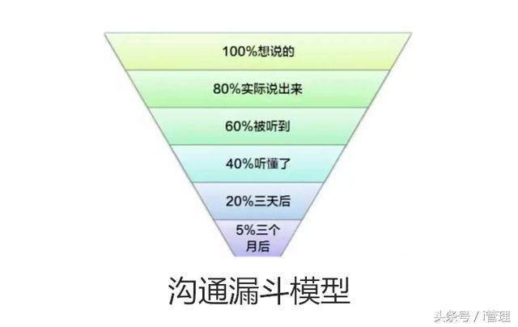

# 建立高效的团队 

## 为什么要建立高效？ 

* 让个人和公司更有竞争力 
* 是为了在紧急时刻按时交付任务
* 高效才有盈余时间学习提升自己 
* 让自身价值有更大的体现 
* 不是（为了满负荷高效率运转，通过更多时间创造更多价值） 

这些都不是套话，作为一个程序员要开放心态，实话实话。 

这里说下辩证关系，希望大家以后也用辩证关系来思考问题，判断事情的好与坏。首先，个人与公司的关系，就是雇佣关系，互相挑选的结果，大家在一起是因为你能提供给我需要的东西，这些东西呢，也不仅仅是金钱。也许是我喜欢公司的氛围，也许是公司能提供我成长的平台等等。所以呢长期来看，个人与公司一定是双赢的结果，否则早就一拍两散了。 

紧急时刻按时交付任务。不高效，每次紧急任务都是一场灾难，灾难过后看看自己还有啥。再说了，公司不成长你愿意一直待着吗？个人不成长公司愿意要你吗？个人要做的事有两件：一是让着始终处于成长中；二是让自己的增长没有天花板； 

盈余的学习时间，谁一个月还没有一两天不舒服的日子需要休息休息？当然，这里说的休息不是休假，而是没有工作状态。流水线式的满负荷不是我们软件设计人员的工作方式，设计人员一定是一张一弛，松弛有度。能专注能高产时别偷懒，不重要的工作放在没有状态时完成。始终记住我们不是通过时间来赚钱的（哪怕看起来像）。 

## 如何建立高效团队 

#### 1、首要是信任 

一个团队要想要高效，想要融洽，信任是前提。没有信任为基础的团队永远不会有凝聚力。那么如何建立这种信任呢？没有太好的方法，只能在工作的接触中一点一滴的积累。 

举个例子，21世纪最贵的是什么？就是团队，有了优秀的团队，做什么事也不难。有个误区是团队中的每个人都是出类拔萃的人才能组建优秀团队。 

如何更好的建立和维护信任？ 

1. 开放。工作中的任何事情都没有秘密，都可以敞开了的说，只有真诚，没有勾心斗角。 
2. 包容。能够给他人提建设性意见，也乐于接受别人善意的帮助（批评）。 
3. 沟通。愿意交流信息、想法，积极主动的沟通。 

也就是说，不充分沟通很难建立信任关系。另外，给予队友犯错的机会，不犯错怎么能成长呢。 

#### 2、良好的氛围 

个人一直比较看重氛围，在良好的氛围里工作更放松，也更有创造力，因为没有束缚嘛。高效离不开良好的氛围，在紧绷的环境中很难做好协同工作。 

这个不多说，主要职责在管理者。 

#### 3、明确的分工 

现在已经是移动互联网时代了，观念在翻天覆地的变化，因此一些旧的观念真的不适合在新的土壤生存，我们要警惕并找出一些与时代脱节的东西，有它在可能并不影响大局，也可能会产生影响，谁能说得清呢。所以能避免就避免，最起码可以对良好的氛围起促进作用。 

例如，一直在强调的，职位不同仅仅是职责分工不同，大家平等对话，都做好自己分内的事就好，这不是空话。 

分工也是为了高效，贪多嚼不烂，专注某一领域才能成就未来。因此我们给予不同分工者以尊重，每个人都是不可或缺的，也不要低估他人的能量。 

当你做事很顺手时，可能背后付出的都是默默不吭声的团队小伙伴，他们将你工作中所有的依赖事项处理的很到位，才有你的顺手，这就是协作（你的最大价值就是在团队中，让他人做事都很顺手）。 

#### 4、共享的信息 

什么是共享信息呢，其实很简单，一个人的知识构成这个人的能量，团队中每个人把自己的能量共享出来，让他人共同拥有，无形中每个人的能量都扩大了几倍。虽然这是个理想的说法，但原理是这么个原理。 

具体的方法有很多种，我们举例几个。 

1. 共享知识库，比如我们的gitlab，大家将自己的技能树共享出来供他人学习。 
2. 技术培训分享会，将经验分享并能当面沟通解惑。 
3. 技术栈、工具链的沉淀，自有的工作开发平台，一致的开发体验，自动化的开发工具 

不要怕自己的能力或技术还不成熟，不敢或不好意思分享。抱有这种想法，十年后你依然还是这样，无法成长。对自己好一点，尽早成长，不要总觉得公司没给你提供帮助，问题是现成的你抓住了没有。 

为什么鼓励大家去分享知识？《费曼技巧》了解下。

#### 5、有效的沟通 

之前多次强调过沟通的重要性。每年重复强调都不嫌少，因为确实很重要，每次老生常谈也不行，听不进去啊，所以这次带来新的模型。 




沟通漏洞模型大致描述了沟通过程中传递信息的衰减，所以要想将一件事情完完全全传达给另一个人，真的是非常困难的一件事。 

怎么解决这个问题呢？这里举个例子： 

```
“日本的大公司规定，管理者给员工部署任务时，至少要说五遍。”具体情如下： 

第一遍，管理者：“渡边君，麻烦你帮我做一件XX事。”渡边君：“是！”转身要走。 

第二遍，管理者：“别着急，回来。麻烦你重复一遍。”渡边君：“你是让我去做××事对吗？这次我可以走了吗？” 

第三遍，管理者：“你觉得我让你做这事的目的是什么？”“你让我做这事的目的大概是咱们这次能够顺利地召开培训，这次我可以走了吗？” 

第四遍，管理者：“别着急，你觉得做这件事会遇到什么意外？遇到什么情况你要向我汇报，遇到什么情况你可以自己做决定？”渡边君：“这件事大概有这么几种情况……如果遇到A情况我向您汇报，如果遇到B情况我自己做决定。您看可以吗？” 

最后一遍，管理者：“如果让你自己做这个事，你有什么更好的想法和建议吗？”渡边君：“如果让我自己做，可以在某个环节......” 
```

五遍讲完，员工现在对各种突发情况、场景都有预案了，再去执行。             

啰嗦是啰嗦一些，但确确实实可以解决问题不是？我们不必非要说五遍，但重复的目的和意义要清楚，在沟通过程中尝试尝试感受一下它的威力。 

另外一个就是沟通过程中碰到敏感因素时容易带情绪，生而为人，谁都避免不了。情绪在可控范围内还好，不影响大家的感情，如果突发不可控造成的后果就会严重，影响感情也影响信任，如何避免这种不可控呢？就是采用正面沟通。 

1. 要努力倾听对方的请求； 
2. 坦率表达自己的感受和需要； 
3. 不要带情感色彩的词汇； 

当控制不住自己时，推荐大家看看《非暴力沟通》。 

说白了，团队的凝聚力就是团队的合力，让合力最大化就是尽量减少阻力，良好的沟通就是减少阻力的工具。 

以上的这些，有些需要你们去做的，有些需要管理者去做的，但无论如何，需要每个人都主动去做些力所能及的事情，否则就没法玩。 

#### 6、一致的目标 

一致的目标好理解，就是形成合力的点，目标分散则力散。

## 高效后的下一步？ 

