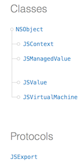
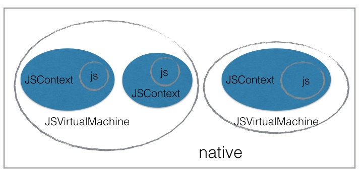
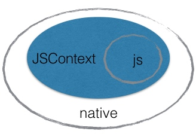
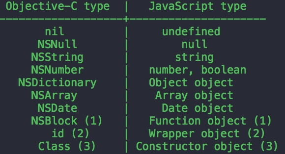

# javascriptCore详解

## 前言

ios7带来的新特性之一就是开放 javascriptCore接口，在此之前， js 与 native 之间的交互都是通过在页面插入隐藏的 iframe 标签，然后重写 webView 监听事件实现。

现在有了新的方式，纵然官方对动态库有签名机限制，但配合 OC 运行时修改特性，也能玩出很多花来。例如 facebook 的 react native，例如 jspatch 等。

## 核心类和协议



由官方文档和头文件（JavaScriptCore/JavaScriptCore.h）可以了解 javascriptCore相关类和协议。

* JSVirtualMachine 虚拟机， js 运行依赖的所有资源提供者。
* JSContext 上下文，给开发者提供访问虚拟机的接口。
* JSValue 对象包裹器，js 与 native数据类型转换的桥梁，这是最核心的类。
* JSManagedValue 对象管理器，用于处理对象的生命周期。
* JSExport 接口导出协议，让 native 对象直接暴露给 js 调用。



JS虚拟机可看做一个独立的进程，实时解析执行 js 脚本，js 与 native 之间通过虚拟机协作，但虚拟机一般不会直接开放给用户操作，所以抽象出一个上下文作为两者互操作的桥梁，两者数据类型匹配问题则单独交给 JSValue 负责。

虚拟机是一个单独运行的实体，用户可以创建多个虚拟机，但虚拟机之间没有直接关联，关联需要用户自己建立逻辑性关联，比如：要实现 js 操作的并发需要底层提供，因为 js 本身是作为解释执行，语言本身并不提供并发性。

虚拟机与上下文是一对多的关系，一个虚拟机可以创建多个上下文供不同用户使用，上下文是作为 js 的虚拟运行环境，可以简单理解为作用域的划分。

## js 访问 native

上文说虚拟机负责实际执行 js 脚本，但不给用户直接设置虚拟机，暴露给用户的是虚拟运行环境JSContext，所以JSContext就作为本地和 js 之间通信的桥梁。



如上图所示：JSContext 作为 js 与 native 之间的桥梁。具体方法为，native 给 JSContext 环境注入全局对象或接口，而 js 可全局访问所在的 JSContext 环境，因此 js 具有了访问 native 对象或接口的能力。

- 给 js 暴露 native 接口

	```
	JSContext *context = [[JSContext alloc] init];
    context[@"log"] = ^() {
        
        NSArray *args = [JSContext currentArguments];
        for (JSValue *obj in args) {
            NSLog(@"%@", obj);
        }
    };
	```

	这里创建了一个 context 对象，然后给这个 context 注入一个log 函数，参数任意。这个 log 函数的功能是把所有参数遍历打印一遍（是不是很像console.log()函数），然后 js 就可以直接调用 log 函数了，因为 log 被注入到js 的运行环境中，使用 log 函数就和使用 js 内置函数没什么区别。
	
	```
	log([1, 'aaa', {name: "join"}]);
	```
	
	然后在输出窗口就可以看见日志的输出。
	
		注意：这里是创建的 JSContext 对象，与 webView 没有任何关系，javascriptCore的开放意味着，js可以脱离webView 而独立存在。
	
	
- 给 js 暴露 native 对象
	
	当需要给 js 暴露 n 多接口时，要不停的注入，接口会越来越多，不方便管理，也会造成 js 命名空间污染，正确的做法应该把接口封装到对象里，这样只注入一个对象就行了。
	
	暴露对象以及对象的方法就需要JSExport协议了。这个协议其实什么都没声明，它只是作为契约存在的。
	
	首先要声明一个协议来继承JSExport协议，然后在协议中声明要暴露的所有方法（这样虽然暴露了整个对象，但不需要或不想让 js 访问的内容可以通过这个协议来控制），最后让对象实现该协议就算完成了。
	
		注意：一定要定义自己的协议来继承JSExport，而不是让对象直接实现JSExport协议。

	下面我们试着按照 console.log()来封装。
	
	* 先自定义协议，声明需要暴露的对象方法：
	
	```
	@protocol ConsoleProtocol<JSExport>
	-(void)log;	
	-(void) otherFunction;
	@end
	```

	* 其次，让对象实现该协议

	```
	@interface Console : NSObject<ConsoleProtocol>
	@end
	```

	* 最后，将对象注入到 JSContext 中，js 就可以使用 console.log 正常调用了。

	```
	JSContext *context = [JSContext currentContext];
    context[@"console"] = [[Console alloc] init];
	```

## native 访问 js

由于 native 掌握 JSContext 的控制权，而 JSContext 本身就是 js 的运行环境，所以：native 可以直接通过 JSContext 访问 js。

	当然，访问 js 是针对 js 的全局对象而言，临时对象是访问不到的。
	

如定义个全局 js 函数：

```
var globleFunc = function(obj) {              
	alert(obj);
};
```

native 侧调用：

```
JSContext *context = [JSContext currentContext];
JSValue *function = context[@"globleFunc"];
[function callWithArguments:@[@"hello"]];
```

那么 native 如何调用 js 对象的方法呢？js 侧可没有 JSExport 协议。

对象方法的调用是由 JSValue 提供的invokeMethod接口实现的，例如我们要访问 document 对象的write 方法：

	JSValue *writeFunc = context[@"document"];
	[writeFunc invokeMethod: @"write" withArguments:@[@"111"]];

如果对象嵌套的再深点儿呢？比如window.document.write，可以先获取内层对象，再访问对象的方法。当然，既然可以获取内层对象，也就意味着不使用invokeMethod，直接获取方法然后调用callWithArguments，这两者都可以。

	 JSValue *window = context[@"window"];
    JSValue *document = [window objectForKeyedSubscript:@"document"];
    [document invokeMethod:@"write" withArguments:@[@"111"]];
    
    //或者
    JSValue *writeFunc = [document objectForKeyedSubscript:@"write"];
    [writeFunc callWithArguments:@[@"111"]];

有的同学可能要问了，JSContext 对象有evaluateScript方法，可以直接执行 js 啊，为什么还要使用 JSValue 调用方法呢？那是因为evaluateScript只能执行 js 脚本，复杂的函数参数无法传递过去，例如js 函数参数是个自定义复杂对象。


## 数据类型转换

javascriptCore 采用的数据类型转换的方式简单粗暴，使用 JSValue 类来适配所有类型。上面的代码就使用 JSValue 接收了 js 的 function 对象，并调用callWithArguments来执行 js 方法。

JSValue 转换的数据类型参见下图：



* NSDictionary 对应 js 中的对象
* NSArray 对应 js 中的 array
* NSBlock 对应 js 中的 Function

而 JSValue 可以代表所有的对象，也就是说，js 与 native 之间要传递数据，首先要将数据转换成 JSValue 对象，并且转换过程在调用时由系统自动转换，只有在少数场合需要自己转换。

	```
	//装箱
	+ (JSValue *)valueWithObject:(id)value inContext:(JSContext *)context
	//拆箱
	- (id)toObject;
	```

还有其他数据类型也是类似。

block比较特殊，这里单独说一下，假如有这样一个场景：native 需要给 js 函数传递一个 block，当满足条件时，回调 block。这就需要对 block 封装传递到 js 侧：

	void (^block)() = ^() {
        
        NSArray *args = [JSContext currentArguments];
        for (JSValue *value in args) {
            
            NSLog(@"%@", value);
        }
    };
    
    JSValue *func = [JSValue valueWithObject:block inContext:context];
    [jsFunc callWithArguments:@[func]];

反过来，native 如何调用 js 的回调函数呢？这个没有办法，官方说明不支持：

	JavaScript functions do not convert to native blocks/closures unless already backed by a native block/closure.

也就是说，对 js 侧的函数访问，仅局限可以从全局对象追溯到的，临时的函数是没有办法封装 JSValue 对象供 native 调用。

	如果想在 js 侧使用回调函数，可使用js全局对象做回调函数保持，当native反调回来时再做转换。

## 避免循环引用

* 我们知道 block 容易引起循环引用，所以在 block 中访问this 对象时，经常需要弱引用__weak，在javascriptCore 中，JSContext 作为运行环境，会对所有成员进行强引用，所以在给 js 暴露 block 时一定要注意不能对 JSContext直接引用，而是使用[JSContext currentArguments]来获取上下文。

	 context[@"log"] = ^() {
        
        JSContext *context = [JSContext currentContext];
        // context ...
        
        NSArray *args = [JSContext currentArguments];
        for (JSValue *value in args) {
            
            NSLog(@"%@", value);
        }
    };

* 不要把 js 对象保存到native 导出的对象上，这样也会引起循环引用。因为导出的对象被 JSContext 强引用，而要保存的 js对象（JSValue）会强引用所在的 JSContext。 如果需要双方都修改的对象，则使用JSManagedValue保持对象并存放在JSVirtualMachine中供双方访问。

* 另外一个场景就是 js A调用 native B，而 native B又反过来调用 js B，这个流程中要避免资源循环引用。

## 异常处理

JSContext 类有个exceptionHandler属性，这是block 属性，可以捕获 js 异常。重新定义该 block可以方便定位 js 异常问题（js 是出了名的难调试）。

```
    JSContext *context = [JSContext currentContext];
    context.exceptionHandler = ^(JSContext *context, JSValue *exception) {
        
        context.exception = exception;
        NSLog(@"catch exception: %@", exception);
    };
```


## 线程安全及并发
	
JSVirtualMachine是串行执行的，它保证了js 执行环境的线程安全，当有多个线程同时访问JSVirtualMachine运行环境时，它自身会同步线程执行，因此javacriptCore 的所有接口都是线程安全的。

js 语言机制本身并不支持并发执行，所以想要提高 js 并行能力，只能将 js 拆解不同的任务放在不同的虚拟机中执行。

## Webview

有了 javascriptCore，js 与 native 的交互再也不依赖笨拙的 Webview，很轻量的实现特定需求。然而，基于目前的框架，大部分的应用场景还是在WebView，获取WebView中的JSContext使用如下代码：

	JSContext *context=[webView valueForKeyPath:@"documentView.webView.mainFrame.javaScriptContext"];


