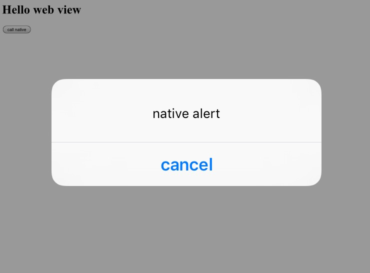

#react native之WebView中注入js（jsBridge）

## 前言

在react native之前，大都采用hybird方案，目前WebView已经是app中不可或缺的一部分，采用react native之后依然需要支撑。react native核心库中就带有WebView的封装，但只是最基础支撑，要扩展WebView的功能，手段之一就是注入js，俗称jsBridge。

react native需要iOS7以上系统支撑，因此注入js有两种方案：

1. 通过Request Url截获解析。这是在iOS7之前采用的方式。
2. 通过系统提供的javascriptCore通信方式。

这里我们讨论第二种方案，如果你对jsBridge不太熟悉，可以看这篇[H5与native之间的通信](https://github.com/xuwening/blog/blob/master/mdFile/H5%E4%B8%8Enative%E4%B9%8B%E9%97%B4%E7%9A%84%E9%80%9A%E4%BF%A1.md)。如果对javascriptCore不熟悉，可以看这个[javascriptCore详解](https://github.com/xuwening/blog/blob/master/mdFile/javascriptCore%E8%AF%A6%E8%A7%A3.md)。

既然已经有成熟的方案，为什么还要写这篇文章？

还是那句话，最好不要修改react native原有代码，对以后的版本控制以及维护都不好，下面就来看看如何不修改react native实现需求，先放出[项目地址](https://github.com/xuwening/code-snippet/tree/master/react-native-inject)。


## JS注入实现

要给WebView注入js，需要WebView资源加载完毕时，获取WebView的JSContext。也就是在`- (void)webViewDidFinishLoad:(UIWebView *)webView`回调方法中通过`[webView valueForKeyPath:@"documentView.webView.mainFrame.javaScriptContext"]`获取上下文，然后就可以为所欲为了。

那么关键点还是在：`如何不侵入react native内部源码`。

这时候category和swizzling隆重登场。首先使用swizzling替换原有`webViewDidFinishLoad`方法：

```objective-c
+(void)load {
  
  RCTSwapInstanceMethods([RCTWebView class], @selector(initWithFrame:), @selector(newInitWithFrame:));
  RCTSwapInstanceMethods([RCTWebView class], @selector(webViewDidFinishLoad:), @selector(newWebViewDidFinishLoad:));
}
```

然后在新方法中，除了执行原有逻辑之外，再执行js注入：

```objective-c
- (void)newWebViewDidFinishLoad:(UIWebView *)webView {
  
  [self injectWebView: webView];
  [self newWebViewDidFinishLoad: webView];
}

-(void) injectWebView: (UIWebView *) webView {
  
  JSContext *context = [webView valueForKeyPath:@"documentView.webView.mainFrame.javaScriptContext"];
  if (context == nil) {
    return;
  }
  
  //自定义注入对象
  __weak typeof(self) weakSelf = self;
  context[@"alert"] = ^(NSString *message) {
    
    dispatch_async(dispatch_get_main_queue(), ^{
      
      UIAlertView *alert = [[UIAlertView alloc] initWithTitle:@"" message: message delegate:weakSelf cancelButtonTitle:@"cancel" otherButtonTitles:nil, nil];
      [alert show];
    });
    
  };
}
```

这里定义了个简单的函数`alert`，用于调用native方法。下面验证下注入是否有效，在js侧定义WebView，并自动调用alert方法，为简单起见WebView加载本地html：

```js
const HTML = `<html>

  <body>
    <h1>Hello web view</h1>
    <input type="button" value="call native" onclick='buttonAction()'/>
    <script>
      function buttonAction() {
        alert('native button alert');
      };
      alert('native alert');
    </script>
  </body>
</html>`;

  <WebView
    ref={'webView'}
    automaticallyAdjustContentInsets={false}
    // style={styles.webView}
    source={{html: HTML}}
    // source={{url:'https://www.baidu.com'}}
    javaScriptEnabled={true}
    domStorageEnabled={true}
    decelerationRate="normal"
    onNavigationStateChange={this.onNavigationStateChange}
    onShouldStartLoadWithRequest={this.onShouldStartLoadWithRequest}
    // startInLoadingState={true}
    scalesPageToFit={true}/>
```

看下效果：



单独提一下，iOS中的WebView每次finishLoad时JSContext都会发生变化，所以要在每次load结束时重新注入js。还有一种情况是，在资源加载过程中需要调用native接口，那么就要在WebView创建时同时获取JSContext注入js:

```objective-c
- (instancetype)newInitWithFrame:(CGRect)frame {
  RCTWebView *slf = [self newInitWithFrame: frame];
  
  UIWebView *webView = [slf valueForKey:@"_webView"];
  [self injectWebView: webView];
  return slf;
}

```

RCTWebView自身提供了一个属性`injectedJavaScript`，用于资源加载完毕时自动执行的一段js脚本。比如你需要把jsBridge的js侧代码库注入到目标页，可以使用这个属性。


## react native的JSContext获取、注入

react native项目自身使用的JSContext与WebView的JSContext不是一回事儿，也就是说你在react native的JSContext中注入接口，WebView是无法访问到的，反之亦然。如果你需要将js接口在react中和WebView中能同时使用，必须两边都要注入。

react native关于JSContext的封装在`RCTJSCExecutor`中，它实现了一个通知`RCTJavaScriptContextCreatedNotification`，当JSContext创建完毕，还未加载main.jsbundle时会发送通知，JSContext作为通知的参数传递过来。

于是，一切就简单了，我们注册这个通知获取JSContext：

```objective-c
+(void)load {
  
  [[NSNotificationCenter defaultCenter] addObserver:self selector:@selector(recieveNotification:) name:RCTJavaScriptContextCreatedNotification object:nil];
}

+(void) recieveNotification: (NSNotification *) notification {
  
  JSContext *context = notification.object;
  __weak typeof(self) weakSelf = self;
  
  //这里由js线程调用，所以UI操作需要指定主线程
  context[@"alert"] = ^(NSString *message) {
    
    dispatch_async(dispatch_get_main_queue(), ^{
      
      UIAlertView *alert = [[UIAlertView alloc] initWithTitle:@"" message:@"native alert" delegate:weakSelf cancelButtonTitle:@"cancel" otherButtonTitles:nil, nil];
      
      [alert show];
    });
    
  };
}
```

功能实现了，不过这里要提醒一句，react native实现了一套js与native模块化通信的机制，虽然我们依然可以给react通过JSContext注入的方式，但不建议这么使用，通过react native提供的模块导出方法才是正道。

关于react native模块的知识，可以参考[react native之模块](https://github.com/xuwening/blog/blob/master/mdFile/react%20native%E4%B9%8B%E6%A8%A1%E5%9D%97.md)

如果需要理解react native通信机制原理，可以参考[react native之OC与js之间交互](https://github.com/xuwening/blog/blob/master/mdFile/react%20native%E4%B9%8BOC%E4%B8%8Ejs%E4%BA%A4%E4%BA%92.md)

这些都偏源码，可能有的读者不喜欢看，后面会单独出一篇`react native模块开发`的章节。


