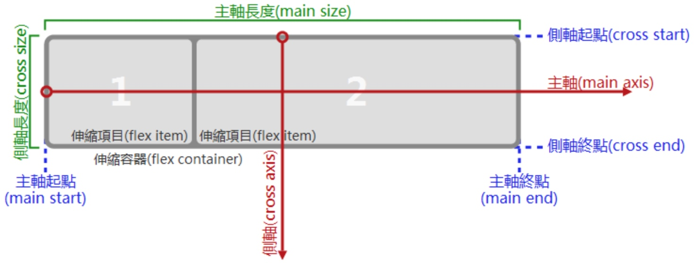
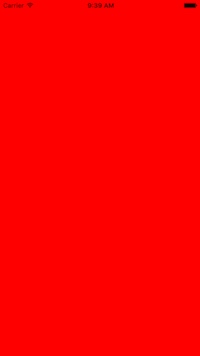
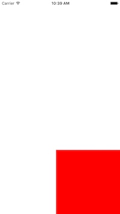
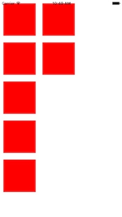
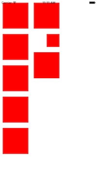

# react native之flexbox

## flexbox主要概念

react native实现了部分css功能，采用css布局方式进行界面布局，其中flexbox特性的支持，尤其对UI的开发带来很大便捷。

布局一般都是针对容器、以及容器内的元素进行设置，flexbox也是一样，但flexbox还有一些自己的基本布局概念：


flexbox有两个轴，用来区分纵横对齐方式，两个方向：正向和反向（默认都是正向），起点和终点是以项目边界为界限。

flexbox就是以这几个基本概念吃撑所有的布局变化。

## 创建样式

react native是通过`StyleSheet.create`来创建样式，前面说了样式是对容器和容器里的项目应用的，所以我们创建一个样式：

```javascript
const styles = StyleSheet.create({
  container: {
    flex: 1,
  },
  
  items1: {
    flex:1,
    backgroundColor: '#ff0000',
  },
}
```

container应用到外层容器，items1应用到子项目：

```javascript
  render() {
    return (
      <View style={styles.container}>
        <View style={styles.items1}/>
      </View>
    );
  }
```

这里都是采用默认flex布局，为了查看方便，容器背景色设置为白色，子项目背景色设置为红色，下面看下效果：



默认情况下，子项目完全填充到容器里，也就是容器尺寸多大，子项目尺寸就多大。

## flex对齐设置

下面手动缩小子项目大小(flex要关闭)，观察子项目在容器中各个位置的布局。

```javascript
  container: {
    flex: 1,
    justifyContent: 'center', //main轴：分别设置为flex-start、center、flex-en
	  alignItems: 'flex-start',//cross轴：分别设置为flex-start、center、flex-en
  },
  
  items1: {
    height: 200,
    width: 200,
    backgroundColor: '#ff0000',
  },
```

`justifyContent`控制main轴的对齐方式，`alignItems`控制cross的对齐方式，通过两者即可控制元素在九宫格中的哪个格子中显示。

例如，将子元素在右下角显示（只需将main和cross均设置为flex-end）：




需要注意一点：`main轴和cross轴没有明确的界限，它是由flexDirection属性决定。`

当flexDirection为row时，横轴就是main轴，当flexDirection为column时，纵轴才是main轴，cross刚好相反。

## flex自动换行

当子元素过多，一行显示不下时，可以使用`flexWrap: 'wrap'`让其自动换行。

```javascript
  container: {
    flex: 1,
    flexWrap: 'wrap',
  },
  
  items1: {

    width: 100,
    height: 100,
    margin: 10,
    backgroundColor: '#ff0000',
  },
```

多增加几个子项目，显示结果：



可以看到元素显示不下，自动换行显示，这对适配不同屏幕尺寸非常有帮助。

## alignSelf属性

alignSelf属性，是子项目在cross轴的特殊设定。意思是，默认子项目cross轴的对齐方式，自动继承容器元素的alignItems，如果不想继承，则可以用alignSelf单独设定。

```javascript
  container: {
    flex: 1,
    flexWrap: 'wrap',
    justifyContent: 'flex-start',
    alignItems: 'center',
  },
  
  items1: {

    width: 100,
    height: 100,
    margin: 10,
    backgroundColor: '#ff0000',
  },

  items2: {

    alignSelf: 'flex-end',
    width: 50,
    height: 50,
    margin: 10,
    backgroundColor: '#ff0000',
  },

```

默认容器元素cross轴中心对齐，这里给最后一个元素特殊指定为尾部对齐。为了观察明显，将此子项目的宽高设定为50。



## 总结

flexbox是种灵活的布局方式，通过简单的几个概念，组合应用可以实现各种布局，react native也因为有了flexbox，界面开发效率大大提高。


