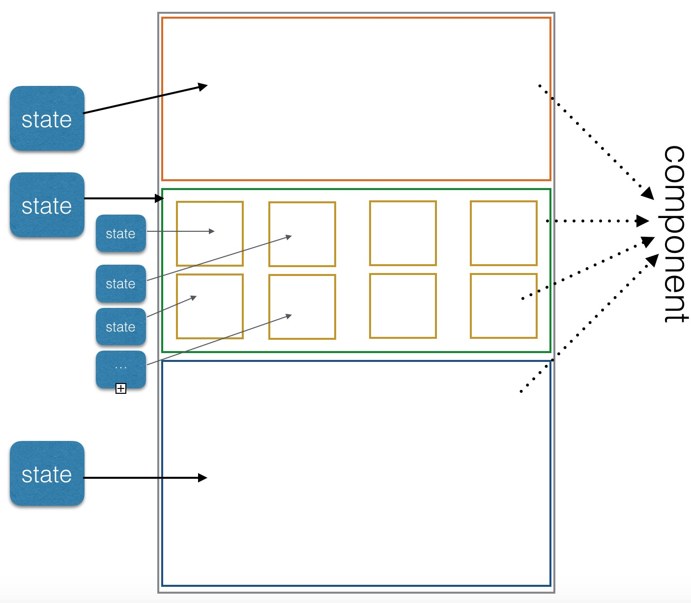

# react native之react

## 前言

要使用react native，首先需要了解react，以及react背后的思想，当然在了解react之前，还是需要点儿javascript和html的知识。

web和客户端本质上没有太大区别，并且web发展比客户端时间更久，更成熟，因此，学习web方面的思想，是有利于客户端设计的。

## react概念

react是一个js库，它出现的目的是为了解决一个问题：构建随着时间数据不断变化的大规模应用程序。

这种复杂度更多的来自于UI更新，如果一个页面有成百上千个UI元素，根据不同条件触发各个局部UI的状态更新，是件很难管理的事。

react解决这个问题的手段是：组件。

组件的强大，来源于组件的可组装特性。从逻辑角度来说，组件就是化繁为简，将一个复杂页面拆解为几个次级复杂组件，次级复杂组件继续拆解，依次循环，直到拆解为足够简单的可复用的组件为止，所以这个逻辑思路是可行的。

可行不代表就没有问题，实行组件化：

* 首先使用要简单，使用复杂再好的理念也白搭
* 其次是性能，不说要提高性能，最起码不能降低性能

react对这两天点的解决方式：采用JSX语法、虚拟DOM。我们的目的是理解react的思想，不必深入原理和细节，这点很重要。

## react创建组件


```js
//创建组件
var con1 = React.createClass({
  render: function() {
    return <h1>Hello {this.props.name}</h1>;
  }
});

//使用组件
<con1 name="aqua"/>
```

创建和使用组件都很简单，采用JSX的语法使得语法更简洁。render是渲染函数，返回需要渲染的数据。

## react参数传递

通过上面代码片段，可以看出react组件参数是通过`props`传递参数的。

`props`是个js对象，对应原生就是dict，具体如何通过属性传递到props中，由react来处理，用户不必关心。

以`<con1 name="aqua"/>`为例，所有参数都通过组件属性传递给具体组件，`name="aqua"`就是传递的一个参数，react会自动将这些参数封装在props中，组件`con1`内部可以直接通过`props.name`来获取组件名称值。如果参数过于复杂就封装成对象传递过去。

## react组件状态管理

所谓状态`state`，即UI更新原则，只有`state`发生改变时才出发UI更新。

以客户端首页为例：



这个`state`是人为约束，也就是说状态的变化是由用户管理的，而非react。react只是对状态进行管理和监控，当监控到状态发生改变时，通知UI进行更新。

之所以有状态这个概念，是因为react的理念是单向数据流，即v和m是单向绑定，v的更新都是通过m来操作。这里存在一个问题：用户可以直接操作UI控件，双向绑定的做法是v反过来更新m，react是通过UI事件监控来更新m，所以要处理好v到m的状态管理。

```js
//state示例
React.createClass({

	//组件初始状态s为false
  getInitialState: function() {
    return {s: false};
  }

  render: function() {
    if (this.props.s == false) {
      //状态未就绪，不渲染界面
    }
    
    //渲染界面
    return <h1>Hello {this.props.name}</h1>;
  }
  
  //触发组件状态变更
  xxxx: function() {
    this.setState({s: true});
  }
});

```

## 组件生命周期

生命周期管理给使用者提供组件各个周期的回调接口，可根据需要做些自定义设置。

* getInitialState，组件被加载之前调用，返回组件的初始状态
* componentWillMount，组件在加载时调用
* componentDidMount，组件加载完毕时调用
* conponentWillUnmount,组件被卸载时调用

上面是最常用的，还有其他生命周期回调，如componentWillUpdate和componentDidUpdate等。通过这些生命周期函数，使用者可以最大范围控制组件的各种形态。


## 总结

react的核心其实就这些了，使用极其简单的概念将复杂性降低。

react将复杂性都封装起来，将简单提供给使用者，起码作为一个不熟悉web开发者，理解起来也不费力。

最后宣扬一下组件的牛叉之处：

* 可组合
* 可重用
* 可维护


