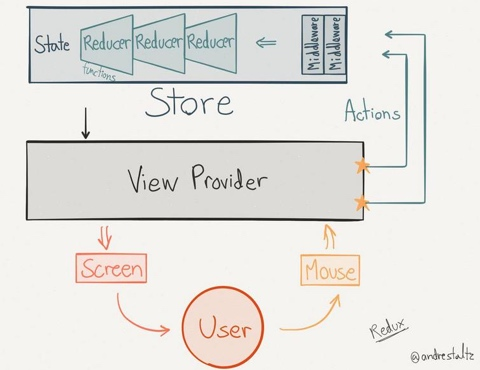
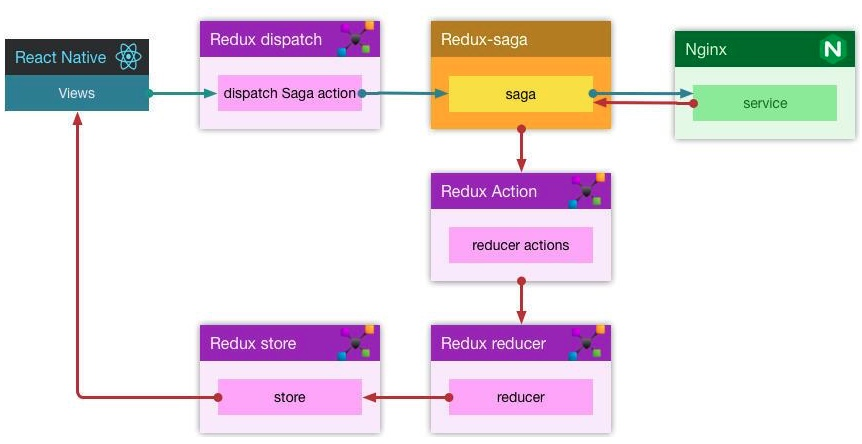

# redux-saga应用入门

## redux-saga简介

redux-saga用于管理redux异步操作的中间件。
由于sagas采用generator创建，因此需要对generator以及promise有些了解，否则很难理解saga的思路。

## redux-saga在redux中的角色

首先，我们先回顾一下redux的应用架构：



再来看下saga在redux中所处的位置：



可以看到，saga是在dispatch(action)和reducer之间插入一层，对action进行拦截处理（针对异步操作，如网络请求），再转发到reducer。

开始以为saga是用异步操作用来解决redux的性能问题，其实不是，它是对异步操作进行集中管理，让整个项目变得更整洁清晰，容易管理。

## saga是如何运作的

saga基于redux提供中间件技术实现的，所以对redux无侵入。它的运作机制类似一个监听器，把感兴趣的action进行注册监听，当action被触发，saga就建立一个任务单独去处理这个action，所有的异步操作完成再dispatch(action)到redux。

将saga集成到redux与其他中间件没什么区别，如readux-thunk，只不过要额外执行一句：

```js
sagaMiddleware.run(mySaga)
```

这句代码的意思是独立运行mySaga，它是用户定义的一个generator函数，这个函数就是用来不停的监听action，并调用相对应的函数去处理action，如：

```js
function* fetchUser(action) {
	const data = yield fetchApi(url)  //异步处理
	yield put({type: "INCREMENT", data: data})  //给redux发送action
}

function* mySaga() {
   yield takeEvery("INCREMENTASYNC", fetchUser); //fetchUser也是个generator
}
```

saga给我们提供了一些辅助功能函数，帮助我们更好的处理action，`takeEvery`就是其中之一，它的作用有两个：

1. 轮询。即永久循环监听，相当于while循环，takeEvery之后的语句不会执行到。
2. 注册action及action的处理函数。

第一个参数是action `INCREMENTASYNC`，第二个参数是action的处理函数`fetchUser`，当收到INCREMENTASYNC时就调用fetchUser处理，至于fetchUser是访问磁盘还是访问网络或者什么都不干都没关系，有一件事必须做，那就是dispatch(action)。

> 可能你已经忘了，再回顾一下上面的架构图，saga干了两件事儿，一是从redux哪里监听action，二是处理完异步逻辑后要把结果重新dispatch给redux。

我们已经身处saga中，而非redux中，无法直接调用redux的dispatch函数，所以saga已经给我们提供好了这个功能`put({type: "INCREMENT"})`，可以看出put与dispatch使用方式一致。

到这里saga的业务流程基本就串起来了，但要再复杂一些的应用，还需要了解一些其他的知识。

## effects

effect概念，一开始就一脸懵逼，到现在也没理解准确，如果按照辅助功能函数去理解反而更容易入门，入门后再深入概念细节。

下面三个是真正的辅助函数，非effect：

* takeEvery 永久监听注册的action，并启动对应的处理函数
* takeLatest 同takeEvery，唯一区别是takeEvery每次监听到action都启动处理函数，takeLatest只启动最后一次监听到的处理函数，之前启动的会cancel掉
* throttle 同takeEvery，区别是可指定两次action之间的间隔时间，即在间隔时间内只处理一次action


effect：所有的effect必须跟在yield之后

* take 用来监听action，如下

```js
function* mySaga() {
	yield take("INCREMENT")
}
```

监听后谁处理呢？参数中并没有指定处理函数，因此take需要结合其他effect使用，比如fork。take与takeEvery等系列同是监听action，但take不能指定处理函数，并且只能监听一次action，要永久监听加上while循环即可：

```js
function* mySaga() {
	while(true) {
		const action = yield take("INCREMENT")
		yield fork(fetchUser, action)  //指定action处理函数
	}
}
```

其实takeEvery等函数也是这么实现的，使用while加take控制的颗粒度更细而已，具体使用哪个根据业务场景需要。

* put 用来发送action到redux

```js
//put(action)
put({type: "INCREMENT", data: {...}})
```

* call 同步调用其他函数
* apply 同call，只是参数形式不同
* cps 同apply，适合处理node风格的函数
* fork 异步调用其他函数，相当于创建了一个task
* spawn 同fork，不过创建的task是独立的
* join 链接task，让一个task依赖另一个task的执行结果
* cancel 取消task
* select 获取redux的state
* actionChannel action缓存队列，配合call可以做到串行处理action
* flush 获取actionChannel中所有的action
* cancelled 当前generator是否被取消了
* setContext 设置saga的context
* getContext 获取saga的context


effect combinator:

* race 只要有一个effect执行完毕返回
* all 所有effect执行完毕返回


