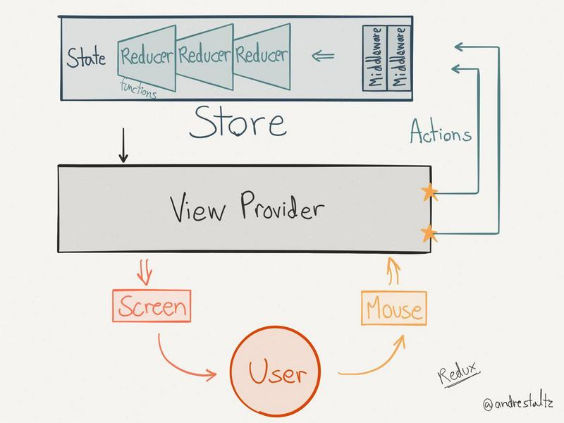
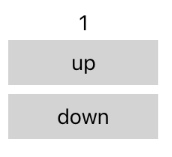
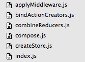
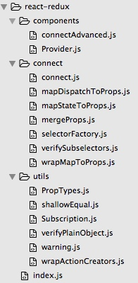
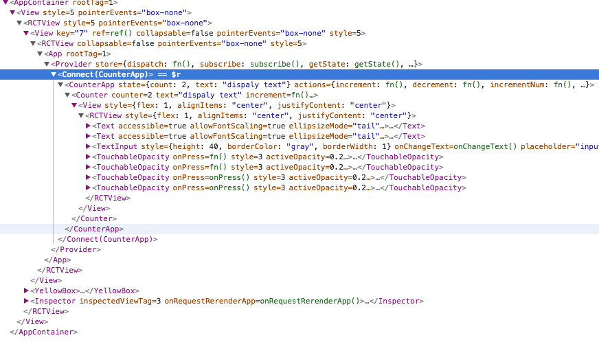

# redux 原理解析

## 什么是 redux

 redux 是由 flux 架构演变而来。这里不谈 flux，只了解 redux 应用架构。
 
 

redux 有三个核心概念：

1. Action 更新 Store 的具体单元。
2. Reducer 是改变 Store 的唯一方式，指明如何更新 Store。
3. Store 是所有的状态数据，对用户来说是只读的，不可改变。

整体数据处理流程：

1. 用户触摸 View产生事件
2. 事件处理程序发送 Action
3. Reducer 接收到 Action，更新 Store
4. Store 状态发生变化，通知 View 更新

由此可见，redux 主要是做状态管理，Store 提供两个函数供外部使用：

1. subscribe用来订阅 Store 发生变化的通知，用户可以通过该订阅，更新视图。
2. dispatch 用来发送Action，让 Reducer 更新 Store，用户可以在接收到用户输入事件时调用。

具体调用使用示例可以参考官网入门 demo，非常简单。需要注意的是，redux 只做状态管理，不做View的处理，因此 redux 需要配合其他框架一起使用，本章使用的 View 框架是 React。

> redux 和 flux 架构概念一致：使用单向数据流处理，避免复杂项目带来的不可维护性。
> react的生态环境为：react、redux、react-redux、redux-thunk，本章介绍除react之外的知识点。


## redux 在 RN 中的应用

redux 起源与 web 开发，因此示例都是基于 web，现在使用redux 结合 React Native写个示例：

```javascript
export default class Counter extends Component {

    constructor(props) {
        super(props)
        this.state = {
            counter: 0,
        }

        this.redux = createStore(this.counter)
        this.redux.subscribe(this.onscribefunc.bind(this))
    }

	 //监听 Store 状态变化，主动更新 View
    onscribefunc() {
        console.log(this.redux.getState())
        this.setState({counter: this.redux.getState()})
    }

	 //reducer，统一处理 Action，更新 Store 状态
    counter(state = 0, action) {
        switch (action.type) {
        case 'INCREMENT':
            return state + 1;
        case 'DECREMENT':
            return state - 1;
        default:
            return state;
        }
    }

    increment() {
    		//分发 Action
        this.redux.dispatch({
            type: types.INCREMENT
        })
    }

    decrement() {    		
        this.redux.dispatch({
            type: types.DECREMENT
        })
    }

  render() {
      
    return (
      <View style={{flex: 1, alignItems: 'center', justifyContent: 'center' }}>

        <Text>{this.state.counter}</Text>

        <TouchableOpacity onPress={this.increment.bind(this)} style={styles.button}>
          <Text>up</Text>
        </TouchableOpacity>
        <TouchableOpacity onPress={this.decrement.bind(this)} style={styles.button}>
          <Text>down</Text>
        </TouchableOpacity>

      </View>
    );
  }
}
```

运行效果：点击 up 数字自动增1，点击 down 数字自动减1。



> 注意点：
> 关于 bind 的使用
> redux 与 react 的 state 不是同一个东西
> react 数据到 view 的更新是绑定的


后续源码均基于当前最新版本，redux在 RN 的应用代码均来自于：[example-react-native-redux](https://github.com/alinz/example-react-native-redux.git)中的Counter。


## redux 代码解析

如何更好的应用 redux，redux 存在哪些问题，以及 redux 和其他框架怎么结合使用？这时候就需要了解 redux 的实现机制。

首先看下 redux 的源码目录：




#### index.js
入口文件：index.js，它是做什么用的呢？看下我们如何导入 redux 的：

```javascript
import { createStore, applyMiddleware, combineReducers } from 'redux';
```

redux是文件夹名称，当导入的是文件夹时，默认会查找该文件夹下的 index.js 作为导入来源，这就是 index.js 的作用。

#### createStore.js

我只保留最核心代码，将代码精简到最小。

```javascript
export default function createStore(reducer, preloadedState, enhancer) {
	
	//保存 reducer
  let currentReducer = reducer
  let currentState = preloadedState
  let currentListeners = []
  let nextListeners = currentListeners
  let isDispatching = false
	
	//获取数据最新状态
  function getState() {
    return currentState
  }

	//订阅监听
  function subscribe(listener) {

    nextListeners.push(listener)
  }

	//遍历所有订阅者，分发 Action
  function dispatch(action) {

	 //分发前更新 state
	 currentState = currentReducer(currentState, action)
	 
    const listeners = currentListeners = nextListeners
    for (let i = 0; i < listeners.length; i++) {
      const listener = listeners[i]
      listener()
    }

    return action
  }

	//初始化数据
  dispatch({ type: ActionTypes.INIT })

	//开放对外接口
  return {
    dispatch,
    subscribe,
    getState,
  }
}
```

可以看出`createStore.js`是 redux 的核心，其作用是把 reducer 绑定到 state， 并把 state 操作的接口对外开放: `分发、订阅、获取状态`。

#### combineReducers.js

`createStore`只能将一个 reducer 和 state 绑定，实际项目需要对 reducer 做拆分，有利于工程模块化、易维护。因此，在实际工程中做reducer 拆分，`createStore`时做动态合并。

先看下实际工程目录：


为了导入多个 reducer，也使用文件夹方式，需要在文件夹中建立`index.js`：

```javascript
//导出 Object包裹所有 reducers
export {
  counter,
  counter1,
  ...
};
```

```javascript
import * as reducers from '../reducers';
```

然后调用`combineReducers`合并所有 reducer：

```javascript
export default function combineReducers(reducers) {

  const reducerKeys = Object.keys(reducers)
  const finalReducers = {}

  // copy reducers 整个列表
  for (let i = 0; i < reducerKeys.length; i++) {
    const key = reducerKeys[i]

    if (typeof reducers[key] === 'function') {
      finalReducers[key] = reducers[key]
    }
  }

  //获取 所有 reducer 名称，作为闭包给内嵌函数使用
  const finalReducerKeys = Object.keys(finalReducers)

  //合并reducers 时，返回 reducer 的包裹函数
  return function combination(state = {}, action) {

    let hasChanged = false
    const nextState = {}

    for (let i = 0; i < finalReducerKeys.length; i++) {

      const key = finalReducerKeys[i]
      const reducer = finalReducers[key]

      //获取对应 reducer 的 state，并调用真实的 reducer
      const previousStateForKey = state[key]
      const nextStateForKey = reducer(previousStateForKey, action)

      nextState[key] = nextStateForKey
      hasChanged = hasChanged || nextStateForKey !== previousStateForKey
    }
    return hasChanged ? nextState : state
  }
}
```

所谓合并，其实是把reducer 列表保存一份，并返回一个遍历reducer 列表调用的函数`combination(state = {}, action)`，可以看出该函数与 reducer 的函数原型一致。所以`createStore`函数中`dispatch`调用的函数就是`combination`，当调用 dispatch 分发Action 时，会遍历所有真正的 reducer，更新 state。

到这里，redux 的整体流程就走通了，剩下的`applyMiddleware`和`bindActionCreators`是做什么用的，后面再说。

## redux 存在的问题

了解了 redux 的实现机制，你会发现 redux存在一些问题。

1. redux 存在性能问题。js 是单线程的，每次 dispatch 都是遍历执行立即更新 state，会造成卡顿。
2. redux 重复性代码依然多，每个页面都需要处理 subscribe 和 dispatch。
3. redux 增加了代码复杂性，但针对复杂项目，这种代价是值得的。

问题3可以针对具体项目做取舍，前两个问题如何解决？这就要说到剩下的两个文件`applyMiddleware`和`bindActionCreators`。


## redux的中间件

在 js 中没有多线程，也就不存在并发执行的方案，js 针对性能问题的解决方案一直都是`异步`，将耗时的操作分割为小单元划分到不同 cpu 时间片中执行。

redux 本身并没有提供异步操作接口，但它提供了解决方案：`中间件`。redux 引入中间件的目的，是让 redux 功能尽量核心、单一，其他功能可采用中间件实现，根据项目需求抉择是否引入到项目中去。

#### applyMiddleware.js

redux 中间件的实现足够小巧：

```javascript
export default function applyMiddleware(...middlewares) {
  
  //再createStore之前引入中间件
  return (createStore) => (reducer, preloadedState, enhancer) => {
  
    //用户不再直接调用createStore函数了
    const store = createStore(reducer, preloadedState, enhancer)
    let dispatch = store.dispatch
    let chain = []

    const middlewareAPI = {
      getState: store.getState,
      dispatch: (action) => dispatch(action)
    }

    //将 state 和 dispatch 传递给中间件
    chain = middlewares.map(middleware => middleware(middlewareAPI))
  
    //包裹原有的dispatch 函数，在执行分发之前，先串行调用所有中间件
    dispatch = compose(...chain)(store.dispatch)

    return {
        ...store,
        dispatch
      }
  }
}
```

由`middlewareAPI`可见中间件的原型必然是：`(getState, dispatch) => ()`。好了，想实现什么功能用中间件吧，比如，异步执行 dispatch更新 state。

#### compose.js

`compose`函数是将中间件函数进行串行调用，型如`f(e(d(c(arg1, arg2, ...))))`:

```javascript
function compose(...funcs) {
  return funcs.reduce((a, b) => (...args) => a(b(...args)))
}
```

#### bindActionCreators.js

先看代码：

```javascript
function bindActionCreators(actionCreators, dispatch) {

  //如果是单一函数，直接返回执行绑定的函数
  if (typeof actionCreators === 'function') {
    return bindActionCreator(actionCreators, dispatch)
  }

  //如果是对象，则对象中有多个 action，需要遍历绑定所有 action
  const keys = Object.keys(actionCreators)
  const boundActionCreators = {}
  for (let i = 0; i < keys.length; i++) {
    const key = keys[i]
    const actionCreator = actionCreators[key]
    if (typeof actionCreator === 'function') {
      boundActionCreators[key] = bindActionCreator(actionCreator, dispatch)
    }
  }

  //返回一个对象，对象中是所有触发 action 的方法 (...args) => dispatch(action(args))
  return boundActionCreators
}
```

`bindActionCreators`是将所有的 actions 和 dispatch 自动绑定。即自动将Action转换为 dispatch(Action)，这样就不用再手动调用 dispatch 函数，只需将 Action 直接和事件绑定，当事件触发时，自动会 dispatch 相应的 Action。

## redux-thunk 解析

`redux-thunk`是一个异步中间件，它也是非常精简的代码：

```javascript
function createThunkMiddleware(extraArgument) {
  return ({ dispatch, getState }) => next => action => {
    if (typeof action === 'function') {
      return action(dispatch, getState, extraArgument);
    }

    return next(action);
  };
}

const thunk = createThunkMiddleware();
thunk.withExtraArgument = createThunkMiddleware;

export default thunk;
```

thunk 是多层函数嵌套，不太容易理解，其实我们只要看最内层函数功能，即可看出其意义。原有 dispatch 函数只能发送 Action，thunk 赋予 dispatch新的功能：`可以 dispatch一个函数，在函数内部再调用真实的 dispatch`。

举个例子，用户触发网络请求，当请求成功时需要更新state：

```javascript
dispatch(function (dispatch) {
    $.get('/api/users', function(users) {
        dispatch({
            type: 'FETCH_USERS_SUCCESS',
            users: users,
        });
    });
});
```

虽然 redux 提供dispatch 的绑定能力，但 redux 本身却没有使用。另外还有一个问题，目前使用 redux 需要在每个 react 组件中进行订阅与分发，无疑需要很大的工作量。解决这些问题，就需要另外一个第三方库`react-redux`将两者进行结合。

## react-redux 解析



这是 react-redux 的源码结构目录，可以看出，它比 redux 要复杂很多，这里我们只对核心机制进行介绍。

#### Provider.js

app 的最外层渲染节点是：

```javascript
<Provider store={store}>
     <CounterApp />
</Provider>
```

这个 Provider 就来自于 react-redux：

```javascript
export function createProvider(storeKey = 'store', subKey) {
    const subscriptionKey = subKey || `${storeKey}Subscription`

    class Provider extends Component {
        getChildContext() {
          //将 storeKey 存入 子组件context，子组件可以获取 storeKey
          return { [storeKey]: this[storeKey], [subscriptionKey]: null }
        }

        constructor(props, context) {
          super(props, context)

          //<Provider store={store}>  将 store 对象保存
          this[storeKey] = props.store;
        }

        render() {
          //表示组件所有子节点this.props.children
          //Children.only返回仅有的子集，因此Provider只能有一个子集，这里渲染CounterApp
          return Children.only(this.props.children)
        }
    }

    if (process.env.NODE_ENV !== 'production') {
      Provider.prototype.componentWillReceiveProps = function (nextProps) {
        if (this[storeKey] !== nextProps.store) {
          warnAboutReceivingStore()
        }
      }
    }

    Provider.propTypes = {
        store: storeShape.isRequired,
        children: PropTypes.element.isRequired,
    }
    
    //要通过 context 传递给子组件，需要childContextTypes声明
    Provider.childContextTypes = {
        [storeKey]: storeShape.isRequired,
        [subscriptionKey]: subscriptionShape,
    }

    return Provider
}

export default createProvider()
```

`Provider`被定义为 react 的组件，所以可以被渲染，它的主要功能是将 `store` 传递给子组件`CounterApp`，传递是通过react的context方式，而不是props。


#### connect.js

通过 Provider 进行 store 传递之后，在子组件`CounterApp`中，由进行了`connect`操作：

```javascript
class CounterApp extends Component {

  render() {
  	 //接收 connect 传递的 state 以及 actions
    const { state, actions } = this.props;
    return (
      <Counter
        counter={state.count}
        text={state.text}
        {...actions} />
    );
  }
}

export default connect(state => ({
    state: state.counter
  }),
  (dispatch) => ({
    actions: bindActionCreators(counterActions, dispatch)
  })
)(CounterApp);
```

connect函数接收两个参数，一个是返回 state 的函数，一个是返回 actions 的函数。最终 state 和 actions 都会通过 props传递给CounterApp，从而CounterApp以及所有的子组件，均可使用redux 进行自动状态管理，不必再手动执行。

返回 actions 的函数中就用到了`bindActionCreators`，用来自动执行 dispatch(action)功能。

`connect`是个包装函数，分别调用的是其他文件的函数，最后会将CounterApp作为参数传递给connectAdvanced函数。

#### connectAdvanced.js

这是个相当复杂的函数，我们不深究，只看关键几个地方:

```javascript
	  //生成 react 组件
    class Connect extends Component {
      
      ... 省略若干代码
      this.store = props[storeKey] || context[storeKey]  //这里获取 storeKey

      //数据发生变化
      onStateChange() {

        ... 省略若干代码
      }

      ... 省略若干代码

      render() {
        const selector = this.selector
        selector.shouldComponentUpdate = false

        if (selector.error) {
          throw selector.error
        } else {
          //动态创建子组件，也就是用户组件。然后把当前组件的 props 传递给子组件
          return createElement(WrappedComponent, this.addExtraProps(selector.props))
        }
      }

      //将CounterApp作为 Connect 组件的子组件
      Connect.WrappedComponent = WrappedComponent

      ... 省略若干代码
    }
```

这个函数最核心的功能，就是创建了 Connect 组件，这是个隐形组件，背后默默的为 redux 和 react搭起桥梁。通过 react-devtools或 inspector 可以观察到：



由图可见，在 Provider 和 CounterApp 之间动态插入了 Connect 组件。至此，我们只要建立 redux 和 react 的关联，将 Action 与 view 事件绑定，其他都可以自动化了。


