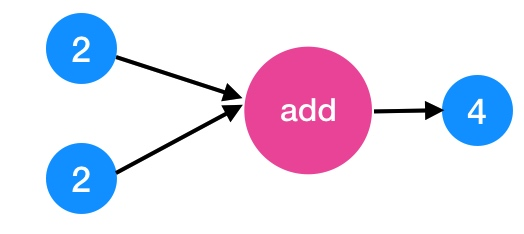
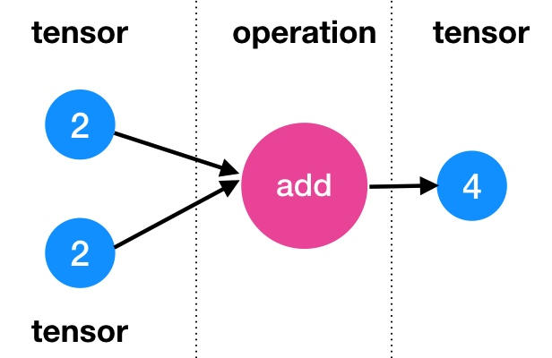
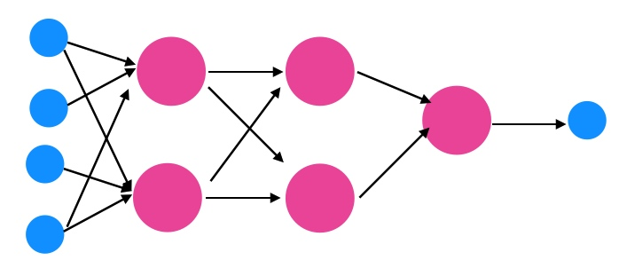
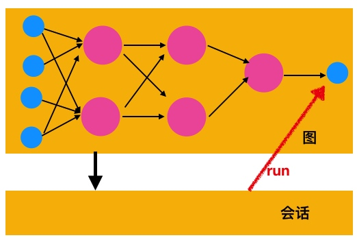
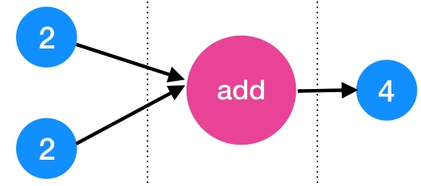

# tensorflow中的基础概念

tensor是张量，即数据，flow是流动。tensorflow其实就是通过控制数据流动，最终输出我们需要的结果。更具体一点的描述是，tensorflow基于类似数据流图的软件架构设计模式，实现了一套深度学习算法库。

## 张量、操作

我们先来看一张图：

这张图描述了两个数据流经一个运算节点add，最终输出加法值4。以add节点为中心，左边的作为输入值，右面的是输出值。

上面的输入、输出数据，以及他们之间的运算都是比较简单的，事实上可以非常复杂，为了支撑这种数据以及操作的通用性，需要对它们进行抽象，tensorflow中称呼数据为tensor，操作为operation。

这意味着，所有的数据要在tensorflow中进行运算，首先必须把数据转换为tensor，把操作封装为op（即operation）。

那么tensor具体是什么样的数据结构呢？
* tensor，即张量，可以理解为多维数组，多维是为了可以描述复杂的数据。
* op，即操作函数，其参数只能是tensor类型。

这么设计的好处显而易见，数据和操作相对独立，更具通用性。例如一个op的输出可以作为另一个op的输入，进而可以无限制链接，进行数据流通，最终形成一张大网，tensorflow中称之为图（graph）。

也就是说，我们只需要最基本的元件（tensor、op），就可以搭建任意复杂的数据计算模型。

> tensor虽然可以理解为多维数组，但它实际是引用对象，只有运行后才会有数据。

## 图

图是tensorflow中的任务单元，虽然我们可以在一张图中构建无限复杂的计算模型，但我们仍然有更好的理由将复杂计算进行逻辑单元拆分，图就是很好的逻辑单元。

假如你没有创建图，则所有的tensor及op都会存储默认图中。

## 会话

前面说要创建任务必须基于图，所有的数据及运算单元存在与图中。图属于构造阶段，是静态的，如果要运行，必须依赖会话，即session。

要运行图，需要基于图创建一个session，然后调用session的run方法。最终，构造的任务单元会运行出结果。

如上图，创建会话要指定基于哪个图做运行。需要说明的是，在调用run方法时需要指定运行哪个节点，一般都会指定最终的结果节点（毕竟我们的目的是要计算结果），但也可以指定其他节点。

当指定某节点进行计算时，tensorflow会自动计算该节点所依赖的其他节点，直到输出结果。

## 常量、变量

编程必然会需要常量和变量，前面我们说tensorflow中的数据必须以tensor的形式存在，因此常量也会转化为tensor然后参与运算，这个比较容易理解。

变量（Variable），要理解它需要了解tensor另一个特点：`不具备记忆功能`。为了更直观的了解tensor，看下图的输出tensor值是4，当输入源的值改变时，它也随之变化，也就是说`固定的输入值，输出值也是固定的`。

因此，tensor扮演的角色是不可更改对象（虽然它可以随着输入值的变化而变化），一旦图中的任务流程确定，tensor就不受外力影响。

程序总是需要一些需要记忆的状态，即可以随时更改它的值，也就是变量的作用。也可以把变量看做特殊的tensor，一种可供外部改变的tensor。

变量在tensorflow中使用需要两点注意事项：

1. 变量需要初始化（将初始化的op加入图中）。
2. 初始化op需要在会话中先运行。

## placeholder

训练样本，就要迭代替换输入源的值，tensorflow提供的解决方式是占位符（placeholder）。把占位符当做输入源，然后在session.run的时候把样本作为参数传递进来。

也许你跟我有一样的疑惑：`不是提供变量了么，用变量不能实现输入源迭代吗？`。

我的思考是变量是可以实现样本的循环迭代功能，但因为变量具有记忆功能，容易破坏图的任务流程，是不好的设计。事实从设计对比上看，placeholder确实要比变量更优良。

> 注：按照`不破坏图的任务逻辑`的设计调度看，图中理论不应该有变量的存在，`不可变`才不会产生副作用。正是这个原因，变量在图中是作为全局对象存在的，逻辑上可以划分到图结构之外。

## 构造阶段和运行阶段

tensorflow中的概念不多，比较好理解。给人造成困扰的恰恰是隐藏的两个阶段概念：`构造阶段`和`运行阶段`，知道这两个阶段的存在，再理解其他概念就容易的多了，就好比`编译时`和`运行时`。

