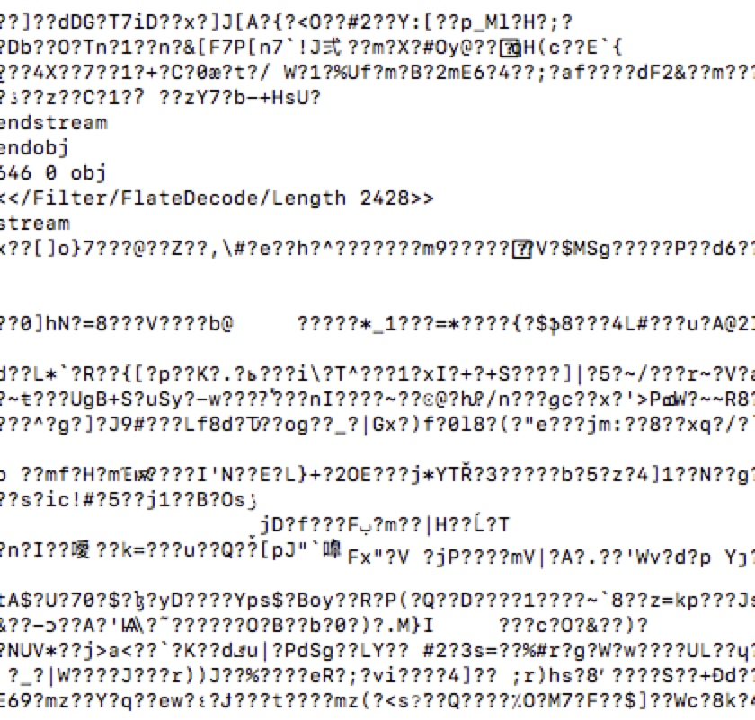
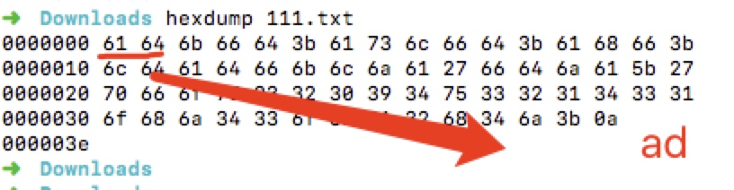
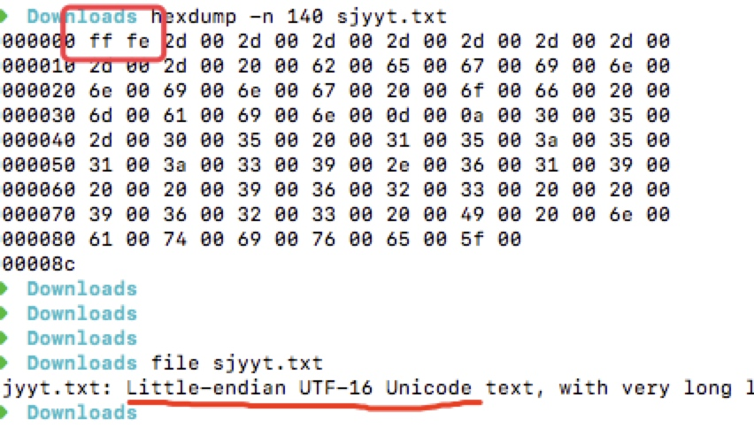
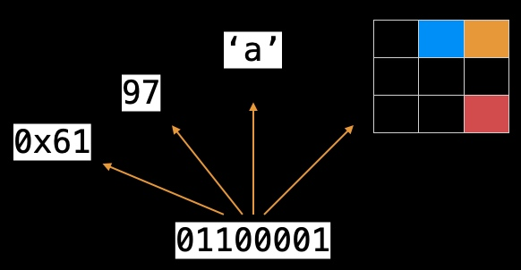
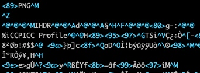

# 文本编码


## 二进制

计算机中用二进制来表示数据。为什么？

1. 运算简单
2. 元器件实现简单

元器件只需要表示两种状态（开、关）：


表示10011，用多个元器件表示：


模拟二进制的电子元器件：

1. 开关的接通和断开
2. 晶体管的导通和截止
3. 磁元件的正负剩磁
4. 电位的高电平、低电平

## 二进制可以表示的数据类型

所谓“表示”，即真实数据到逻辑意义的转换形式。只要你愿意，可以把0和1组成的数据代表任何数据类型。从计算机的表示形态可以看到，从文本到多媒体都可以表示。

而通用的逻辑意义的转换形式被制定出来，就是所谓的标准，例如：ASCII、JPG、MP4等。我们按照这些标准去处理数据，任何人都可以正常识别，从而达到信息传播的目的。

假设你接收到了一段二进制数据：

```
101110011010101011010101011111101010110101010101010110
```

如何知道这段数据代表了什么？

两种办法：

1. 给你发送这段数据的人，告诉你这是utf-8编码的文字
2. 在这段数据的开头用特殊字符标识


## 文本的编码史

为了简单，我们省略99%的编码，只说最通用的。

ASCII

中国：

GB2312 GBK  GB18030

unicode字符集

编码方案：
utf-16 utf-32 utf-8

所有编码都对ASCII进行兼容。

思考：

1. 文本编码有什么缺陷？
2. 产生乱码的原因是什么？
3. 文本是不是二进制数据？文本和二进制的关系？




没有编码（格式）标识:




Utf-x 系列规定了文件头标识，但为了向前兼容，不强制设置:




## 二进制解读举例

一字节二进制数据`01100001`解读:




文件数据识别：

1. 文件扩展名
2. 标准化文件头格式


png:




mp4:


网络数据识别：没有好的办法，只能靠约定。


## 编解码

编解码不是加解密，两者的区别在于：编解码是明文，它的目的不是为了隐藏信息，任何人都可以按照规则对编码进行解码。

编解码的目的一般是为了方便传输。

base64就是常用的编解码：比如在json的报文中想携带一张小图片。按照上面的文本编码来说，json中只能存在文本，没有办法嵌入二进制数据，这时就可以把二进制数据进行base64编码放入json体中。

url编解码：目的是为了在url参数中携带特殊字符，如+、#、?以及中文等。这时通过url编码，将这些特殊字符进行转义，接收方再进行解码就可以正常传递。

base64和url混用：目的是在url中传递二进制数据。将二进制数据进行base64编码后，依然会包含url参数敏感字符，所以不可以直接传输，需通过url编码。接收方需要先进行url解码，再进行base64解码。


