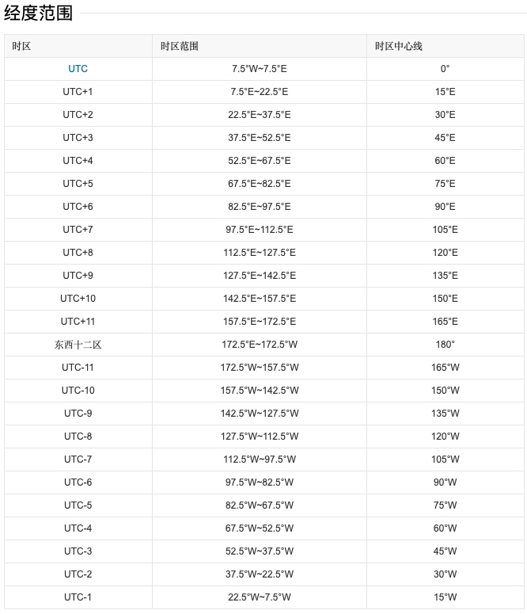
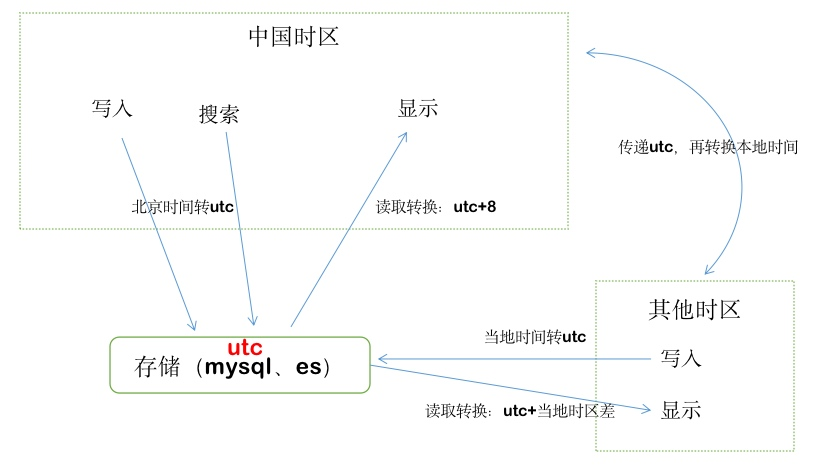
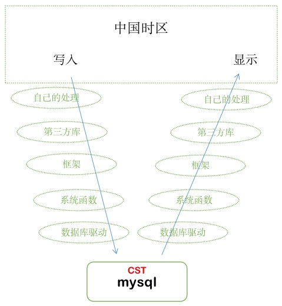

# 时区问题

## 时间戳

程序员最熟悉的就是时间戳，也就是Unix时间戳(Unix timestamp)，时间戳是指1970年01月01日00时00分00秒起至现在的总秒数。

为什么称为Unix时间戳？因为这是Unix系统最先采用的一种方式。

为什么采用这种方式？因为从公元前到现在几千年时间，表达完整的时间区域范围很困难，因此就采用相对时间范围。

为什么是1970年？因为Unix最早发布时间就是1970年。

那个时代都是32位机器，因此能表示最大数就是2^32，换成年总共也就能表示1970年之后的68年时间，也就是2038年，超过这个时间系统就会出问题。这个时间被戏称为计算机时间的“世界末日”。最后是如何解决的呢？就是现在的64位系统，2^64能表达的时间范围真能够到世界末日了。

## 时区

Unix的时间戳如何区分时区的呢？

1970年01月01日00时00分00秒指的是格林威治时间，也就是GMT（Greenwich Mean Time）。

而我们常用的是UTC时间，UTC和GMT是什么关系呢？UTC（Universal Time Coordinated）是世界协调时间，简单来说UTC可以近似为GMT，只是从精度上来说UTC时间更精确。

就像每个地区看到日出升起的时间不同，各个地区就存在时间差。太阳的位置不变，各个地区看到太阳的时间不一样是由于地球的自转造成的。因此，时区和地球的经度有关，UTC就是按照不同经纬度进行时间的加减补偿，从而达到世界时间（地球时间）的统一标准。




## 中国时区

中国所在经度是多少呢？


我们可以看到中国横跨了五个时区：东五区至东九区。按理说中国应该有五个时区分段，但是我国比较霸气，跟秦朝时候一样要统一，于是中国时间只有一个北京时间，由于北京是在东八区，因此又称为东八区时间。

CST：China Standard Time，即中国标准时间，也就是 UTC+8:00。

北京时间确实很方便，但如果作为一个没有出过省、对时区概念不清晰的程序员以及数据分析人员，在时间上可能会碰几鼻子灰。例如在东北早上五六点就起床了，而在新疆晚上两点可能才睡觉。

## 时区的处理

最简化处理多时区问题就是通过UTC来统一存储，如下图所示：




按照标准UTC时间进行存储、传输，只在显示层做UTC与当地时区转换。可以看到这种标准方式非常简单也不容易出错，而且国际化，elasticsearch也推荐这种方式。

## mysql时区问题

到网上搜索mysql时区的问题非常混乱，时间有差3小时的、6小时的、13小时的，各种问题都有。之所以这么混乱主要问题是将mysql的时区设置为了CST。

前面说了CST是China Standard Time的缩写，但是很不幸，不只有中国标准时间是这个缩写，总共有四个：

```
	•	美国中部时间 Central Standard Time (USA) UTC-05:00 / UTC-06:00
	•	澳大利亚中部时间 Central Standard Time (Australia) UTC+09:30
	•	中国标准时 China Standard Time UTC+08:00
	•	古巴标准时 Cuba Standard Time UTC-04:00
```

因此按照哪个时区算，跟用的数据库连接驱动有关，不同的驱动识别CST不同，读取到的时间也会不一样。还有一点需要注意：你无法看到真实存储的时间是多少，你所看到的时间都是通过数据库连接驱动进行转换过后的显示。这是读数据的一条路线，还有写数据的路线，假如是别的模块去写时间，那么意味着写模块的数据库驱动也存在同样的时区问题。

解决mysql时区问题，首先把CST明确为UTC+8。

如果还是不正确就要梳理写入和读取的各个环节是否完全匹配，如下图：




这些环节可能都会影响到正确的时区解析。

