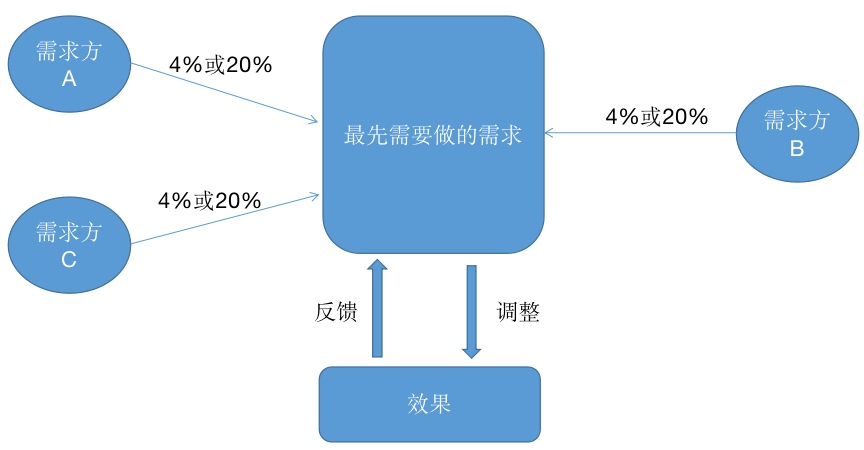

# 关于创业方向的实施

## 前言

在上一篇《关于创业方向的思考》中，我们探讨普适性的理论模型。在这一篇中我们继续探讨创业实施中的理论模型。

方向确认了，也规划了战略，那么就到了实施环节。在具体实施时，对于创业公司来说，一切都是零，有太多东西要实施，如何在繁杂的各种环节中始终走在正确的道路上，让资源最充分利用，在最短的时间内达到我们的期效果，这就是这篇要讲的，也是对上一篇的精益创业的补充。


## 人员构成

人员构成依据项目需求而定，而在需求未确定情况下，人员构成依赖公司领导人的经验和能力。

在需求确定的情况下，我们可以针对二八原则来减少创业初期的人员成本。同样依据幂律分布：

```
80%的业务都是20%的人创造出来的，理论上我们只要招聘20%到30%的就可以完成任务。
```

这里存在一个问题：理论模型与现实的冲突，即数学模型是理论化的、精确的，而现实世界存在各种因果关系及干扰因素。

按照现实模型，上面的例子变成：

```
80%的业务都是20%的人创造出来的，并不意味着80%的人不需要，缺少这80%的人支撑20%的人也许什么都做不了
```

如何解决这个问题？思路：`将关联依赖较多，但价值不大的业务进行削减`

```
按照分型理论找出最最核心的相关人
二八法则：           20%       -----   80%
二八法则次级：        4%        -----   64%
二八法则次次级：      0.8%      -----   51.2%

也就是说，这0.8%的人的工作，所依赖的资源必须100%支撑。剩下19.2%所依赖的资源就可以进行削减，而完成度可以达到一半以上
```

> 注意，这里说的是在项目初期可以精简招聘人员（为了快速试错，只做核心需求），后面等项目稳定发展时再扩招人员。

## 精简需求

你应该想到了，我们依然应用幂律分布原则：


`将核心需求 + 依赖的需求 = 初期目标需求`

若进行估算出来的结果超过一定阈值（如70%），可以将核心需求继续削减（找核心需求中的20%），直到符合我们的目标。

## 中庸之道

项目通常是满足多方需求，因此在需求赛选过程中需要顾及。也就是说，需求可能来自多方，有来自投资方的，有来自客户的，有来自领导的，等等。

通过幂律分布兼顾多方利益：



也许你会说，削减了需求方肯定会不高兴，并没有兼顾多方利益。事实上幂律分布的优势就在这里，一般削减的需求都会是隐含需求。当然不排除个别无关痛痒的需求，一般需求方会理解，实在不理解的话，针对工作量大的需求要据理力争，小的顺手做了也就做了。

## 快速验证

即便已经划分了核心需求，可能依然是不小的工作量，甚至有些是苦力型工作量。那么采用精益创业的思想，初期要灵活。比如：资料的录入初期可以采用人工，那么资料入口以外的环节全都不必做；有现成的模块可以直接购买或合作，而不必重头开发；耗时耗力或不擅长的可以外包……

一切都是为了快速验证结果。

## 还剩什么

我们一直说可以通过幂律分布原则来撬动那个点，进行四两拨千斤，但一直没有说如何找到那个点，也就是那个20%。

所以剩下的问题是：

```
1、如何找出那个20%的核心点？ 
2、如何确认选择的核心点是正确的？
```

对于问题一，可以采用结构化思维，具体参考《极简思考》，问题二的话就是上面所说的快速验证。


## 总结

有程序背景的可能发现我们主要应用了软件行业的快速试错方法。针对现在快速变化的社会，干扰因素越来越多，我们很难一次就选择正确的方向，也不能安静的慢慢打磨一件产品，唯有不断动态调整自身，才能期望好的结果。

