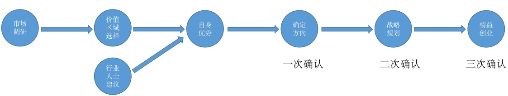
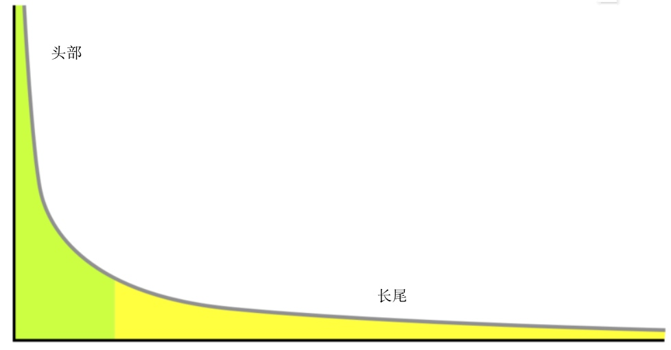
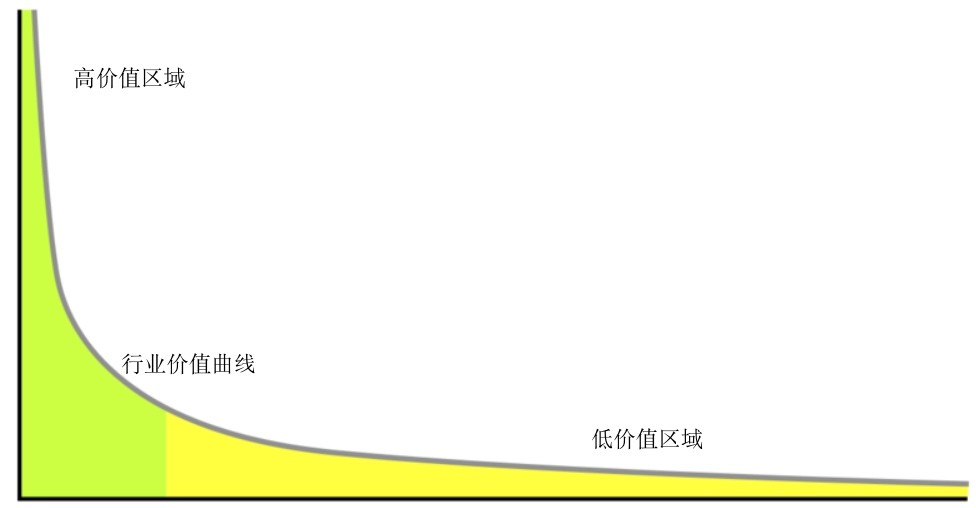
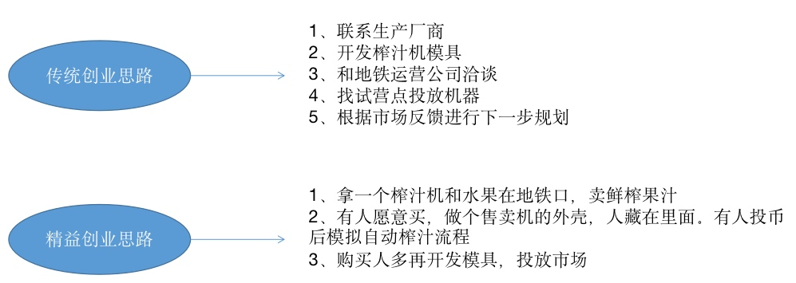

# 关于创业方向的思考

## 背景

最近有机会参与到一个新的创业项目中，实际上上一个项目本就是创业项目，只不过方向是既定的，努力实现目标就好。而这个项目是什么都没有，方向都没有，从零起步。唯一有的就是线下实体公司，是做重卡销售的，行业与互联网不太沾边，也给不了太多建议，只是因为线下越来越难做了，利润空间越来越小，行业内变化也越来越快，跟互联网挂钩是想求变求生存。

从零起步，意味着没有人员，没有办公地点，对重卡行业又完全不懂，之前的技术积累有大半用不到，真真是革了自己的命。

其他方面都还好说，毕竟有过经验，唯独创业方向的选择从来未有过任何实际经验，何况面对的是如此陌生的一个领域。

## 解决问题的角度看待创业

假如把如何选择创业方向作为一个问题来对待，那么本质上和解决其他问题没有什么不同。

这对我的启示是可以用现有的方法论去对待选择创业方向这个问题。不同点是，创业问题更像是把一般性问题通过放大信号器放大了几百倍甚至上千倍，在一般性问题中，某些矛盾、瑕疵可以忽略不计，但在创业问题中就很凸显，甚至会致命，而创业机会可能只有一次。

我们的问题是：如何选择创业方向？

如何解决这个问题有多种方式，有通过突然的灵感一闪，有通过对行业的深刻洞察，有通过人脉等等。无论哪种方式，无论专业不专业，都不能证明比其他方式更好或更坏。

我期望的是更具有通用性的方法论，不具有可复用性意味着没有太大价值。因此我开始思考并搭建自己的理论框架。下图是我对这个问题的思考所列出的模型：



这个模型适用于所有行业，当然，不同行业中的效用可能有大小之分。最不济也可以作为补充的一种思考方式。下面面针对这个模型的各个环节依次讨论。

## 0. 一切的前提

在提出理论模型之前，首先要假设一个大前提，即：`大部分行业内人士，并不真正能看到行业趋势`。

我们的一切基础都以此为条件，否则就没有意义（要不然随便找个行业内的人去做就好了）。当然我们可以找出一些证据来证明这个前提的存在，但这不是重点，所以不在这个论点上浪费时间。

当然，对行业认知比较有洞察力、有大局观者不在此列。但依然意义不大，能和这种资深行业人士合作本就是强强联手，还未开始就已经成功了一半。我们要找的是适合大众的通用模型。


## 1. 市场调研

在如今任何事情都要量化的年代，市场调研是必然要做的，任何理论模型，必然要有数据支撑。

需要注意的是，我们调研的目的不是为了直接作出决策（事实证明这种决策方式通常不太靠谱），而是为了进行价值区域选择。也就是说，具体调研什么，采用哪种调研方式都依赖于价值区域。

## 2. 价值区域选择

在解释价值区域之前，先了解下幂律分布。

#### 幂律分布

幂律分布其实就是我们常说的二八法则，如：

```
80%的财富掌握在20%的手中
对一件事起决定性作用的，往往是少数几个因素
80%的工作是在20%的时间内完成的
```

它的函数图形是这样：



靠近头部的部分，就是那20%，可以观察到尾部跟长长的尾巴一样，它就是长尾理论，不过长尾理论不在我们的讨论范围之列。

因为头部是是那20%，因此它就是高价值区域，反过来尾部就是低价值区域：



从理论角度来讲，方向选择肯定是要找高价值区域。但实际上，大家都会选择高价值区域，因此高价值区域的竞争会异常猛烈，如果你的基础不够雄厚，高价值区域不见得是好的选择。

如何选择合适的价值区域呢？在具体应用幂律分布之前，还需要知道幂律分布的另一个特征：分形理论。

#### 分型理论

分型理论就是自相似性（自同性结构，即子部分的形状与整体的形状相似，依次递归）。

例如：菜花、大树等，大自然有很多这样的元素存在。它的特点是：菜花掰下一块，它的形状轮廓与此前的整颗菜花是基本一致的。

那么分型理论有什么作用呢？针对幂律分布来说，二八法则可以按照子部分继续划分：

```
80%的财富掌握在20%的手中，按照分型理论，这20%依然遵循二八法则

二八法则：      20%        -----   80%
二八法则次级：   4%         -----   64%
二八法则次次级： 0.8%       -----   51.2%

相当于0.8%的人掌握了世界上一半的财富。
```

同样，在高价值区域有更核心的高价值区域，找到整个行业中的0.8%最高价值区域，就可以实现整个行业的一半利润。相信你看到这里一定会很激动，但是记住，这是理论，现实社会则要复杂的多。

## 3. 行业人士建议

在整个环节中不能缺少行业内人士，行业内人士会有第一手资料，会让你少走很多弯路，会有很多中肯的建议，所以在方向的选择中，行业人士的建议有很大参考价值。在模型中占多大比重，就要依具体情况而定。

## 4. 自身优势

自身优势就不用说了，创业中肯定要把自身优势放大，但在方向选择时，不要将自身优势作为最大的左右因子。创业是个逆人性过程，不要在初期就把自己放在温室中，你所认为的优势不一定是真正的优势。

## 5. 确定方向（一次确认）

说了这么多，到底如何确定方向呢？

首先调研整个行业市场状况，整个市场有大多？有多少细分市场，龙头企业是谁等等。然后将整个市场按照价值区域进行划分，找出哪些是高价值区域，哪些是尾部区域。

好了，市场在我们面前已经初步轮廓了。现在要考虑自身有多少资源（多大的资源决定了你能做多大的市场），在价值区域中找出所有适合自身资源的价值区域。

最后，在可选择价值区域，依据：高价值区域、行业人士建议、自身优势的顺序原则，选择最合适的一个价值区域。

可能你会想，这能证明我选择的是最合适方向吗？回答是不能，任何选择的正确与否，只能依据结果来验证。我们探讨的是作为普通人或行业外的人，如何做更优的方向选择。不过不用灰心，我们的模型还没有探讨完。

## 6. 战略规划（两次确认）

到目前我们已经初步作出了创业方向，这个方向是不是合理，是不是具有实施性，以及和我们预期的目标是否一致，还都不是很明确。

> 目标，例如一年实现盈利，或三年内抢占市场等

有了方向和目标，我们就可以做战略规划了。战略规划不仅作为目标的指导依据，同时也是对既有方向的再次确认。也就是说，在做战略规划时可能会发现方向选择错了，或与我们的目标不符，这时可以重新选择创业方向。

商战一般分为四种类型：`防御型、进攻型、侧翼型和游击型`。作为创业公司，更适合打侧翼型和游击型商战，游击型商战前期追求的是先活下来，而侧翼型商战属于战术奇袭，风险较大，依赖的资源也较多。


## 7. 精益创业（三次确认）

什么是精益创业？我们举个简单的例子：

```
创业点子：地铁站售卖鲜榨果汁                                          

1、地铁站流量大
2、年轻人都爱喝绿色食品
```



我其实不太了解什么是精益创业，我只看重了其中一点：`快速确认`。因此我称它为`快速试错法`。正因为普通人无法直接看到行业的趋势，所以创业就是不停尝试、不停反馈的过程。

快速试错，意味着我们可以用更短的时间，用更低的成本来验证方向的正确性。

## 总结

假如不同基础条件作出的方向选择，最终导致成功的概率不同。理论推导不一定正确，但作为一个附赠基础条件的话，最起码可以增加成功率。

这篇作为选择创业方向的理论，下一篇介绍创业实施过程的理论《关于创业方向的实施》。


