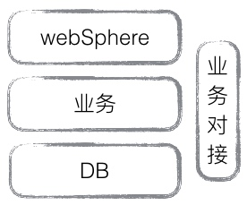

# 如何做好一个大中型项目

## 前言

可能每个人对大中型项目的理解存在歧义，所以首先描述一下我所谓的理解：

* 用户量要大
* 异构
* 多方合作
* 参与人员角色多
* 项目周期长

每个条件基本都会映射出很多问题（当然，不是每个条件都是必须的）：

	用户量大，才会有并发，有性能瓶颈，会在非功能性需求上做很多工作；
	异构，更多维度，全局思考项目架构；
	多方合作，理解沟通的重要性，尤其是异地沟通；
	参与人员角色多，如何有效组织人员结构，推动多部门协作本身就很困难；
	项目周期长，经过需求的不停演变，架构随之演变成长；
	
为什么会出现软件工程体系，要解决什么问题？这是快速理解现代软件开发的快速途径。
随着软件的发展，开发团队越来越大，团队管理和工作效率成反比下降，有效沟通和执行占据很大比重，另外，非功能性需求也占据了很大项目周期。有幸经历一个从零起步的公司，工作中接触到各个环节，虽不专业，长期下来倒也有些自己的感悟，下面针对典型的问题，说说个人之言。

## 项目背景

帮助集团公司开发APP，包括iphone、android和wp，由于集团服务客户群比较庞大，需要开发后台与集团后台对接，除了集团核心业务外，还需支撑省公司特色业务，对接集团拓展业务平台，林林总总几十家大小公司交叉对接需求。app从初期的业务查询办理渐渐变成了平台性质。

## 技术演变

	之所以把技术提前说，可能大家更关心技术侧，恩，我也是。

技术总监是c出身，所以最初技术格调基本定型，无论客户端还是后端服务均是c开发，除了运营平台这种牵扯web的，怎么都离不开c语言，所以各种苦逼注定跑不了的。客户端和服务端分开来说：

1. 客户端侧
	
	立项时只做android和iphone客户端，当时的客户端架构是分了两大层：UI层和底层库层。UI层按各平台实现，底层库采用c实现，为了实现跨平台，实现数据的一致性和复用性。一图胜千言：
	
	

这种架构其实还可以，网络层采用curl，因为要支持https，所以另外集成了openssl，通过接口获取数据并执行业务逻辑，然后给UI层提供Modal直接使用，客户端平台只实现界面展示和输入控制。

这个架构的好处是除了 UI 层依附于平台，其他层都是跨平台的，可以专注 UI 开发或业务逻辑开发，附带的代价是 C 层的维护成本，但这个代价是值得的。

	需求变化：
	* 要开发wp版本
	* 后台架构调整，表示层从xml转为json
	* 网络需求复杂度提高

开发wp版本首先要将底层库移植到wp上，但是openssl对wp不兼容，移植过程很艰辛，不能保证稳定性，最后就放弃在wp沿用底层库的想法。

那么android和iOS是否沿用底层库？最后还是放弃了，基于以下原因：

	* 底层库采用c实现，处理字符编码以及内存泄露还是比较困难的，libcurl 在手机端的定制需求较多。
	* 网络状态各种新需求导致开发效率低下，各平台的开源网络库已经很完善，易用性和定制扩展方便更好
	* 底层库更适合写统一的业务逻辑，但app的业务逻辑本身比较简单，并没有带来多大效用

第二个阶段就是各平台自有实现。采用的传统的框架设计：

	这次采用了H5技术，适应局部界面的快速开发和在线部署
	增加js bridge这一层，可以把native侧的UI和接口暴露给H5调用，混合式开发更灵活

传统框架还是有很多缺点，不能适应快速变化，维护成本也越来越高，在下一阶段准备重构整个客户端，采用组件式、模板化，做为平台支撑。

客户端的痛点经常集中在线上bug修复和动态部署，H5能解决一部分问题，但体验始终是硬伤，android还好，开放性比较高，容易解决，iOS平台就没这么好运气了，签名机制始终是绕不过去的坎。还好iOS有运行库，支持运行时修改，加上iOS7的javascriptCore的开放，变相支撑还是可以的，只是成本有点高。

2. 后端服务侧

	最初用户数支撑较少，后端架构分了经典的三层：
	

		我们后台只对接客户端，不针对web，所以websphere主要充当接入服务的功能
		为什么要用websphere？甲方拍板的这种事我会告诉你么？
	
架构上没有问题，虽然websphere撇在那里有点别扭。
之前说过，技术总监是c出身……业务服务和业务对接服务之间采用tcp长连接，均c++开发，集团提供的服务是http协议。好了，聪明的读者这时候已经看出问题了，websphere对客户端提供的也是http协议，咳……这种纠结的问题就不说了，读者自己体会（webshpere 作为 IBM 的产品是不差的，IMB 的整套方案中 websphere 后挂接的是 IMB 的 mq 产品，太贵所以没有采购）。总之，多加了些工作量和bug数量和维护量。
紧接着websphere出问题了，websphere当时不支撑servlet3.0，采用websphere的亏还是吃了，同步请求是不行的，没办法只能改造了，写了个c库，JNI调用，加入队列异步发送请求。

	c层可直接使用的开源软件不多，很多轮子得自己造，为此开发了很多组件，有线程池，数据库连接池，通信组件等。

第二阶段，技术选型有了自主权，再加上集团接口并发量太低也要进行改造，所以基本重写了整个后台。大面积采用开源软件: dubbo、redis、tomcat、Shiro、nginx、fastDFS、mongodb、netty等。架构也是参考开放大公司的基本架构，没什么太多可说的，唯一要处理的就是和各种系统集成对接。

这样服务基本很稳定了，剩下的就是大数据的处理了。

后端业务开发还是用java比较折中，性能不差，开发效率也可以，人员也容易招聘。后端的框架或中间件大部分都是c或java写的。开源软件对搭建大中型系统带来很大便捷，可以把精力放在业务开发上（不用关心大小端、网络字节序、异构等问题），就算出问题，源码在手怕啥。

## 需求

一切变化源于需求！多经典的一句话。如果做自己的产品还好说，如果帮别人做产品那就太惨了。注意这个词汇：帮别人做产品。之所以不说外包，因为真正的外包需求都是比较明确的，只要大方向评估好，无非在项目进行中被甲方改几次小需求就好。帮别人做产品不一样：

* 首先，需求的不确定性。因为是大项目嘛，跟美剧似的，先拍两集看看效果，市场效果好，来个第一季，恩，不错，那就再来第二季，以次循环……可是，可是，真是的场景是这样：拍两集样片，不好，重拍，又不好，再重拍，以次循环……只样片上就退了两层皮，更别提第一季第二季了

* 其次，需求的来源杂。甲方不太懂移动互联网，让乙方提需求，甲方拍板，结果是好需求拍死了……后来，需求抄抄这个，仿仿那个，也不管是不是同一领域的产品……再后来，甲方各部门都有自己的需求，改，哪天高层觉得这个不好，改。

* 最后，需求的矛盾性。需求的变迁维护很可怕，一个简单的需求在不同的版本改了很多次，版本之间的需求是矛盾的，不幸的是，所有线上版本都要兼容，最后导致的结果是，随便增加个很小的关联需求，都要讨论技术方案，否则可能影响线上业务。

其实做产品的同事应该也有这种体会，但是主动权在自己手里，会幸福很多，假如体会不到幸福，那是因为你还没碰到苦难。

如何破？最优方案就是招个牛逼的产品经理，充分了解甲方业务，找到甲方的痛点，引导甲方。在技术测，需求评审要充分，方案设计要争取充足的时间，设计的时间在实现阶段可以补回来。设计阶段是最重要的，大家都明白，如何落实和执行是另外一个问题。

如果你说牛逼的产品经理可遇不可求，那么第二套方案登场。搞过客户端的同学可能都有这样的体会：产品经理的这个设计违背了系统的设计原则。是的，客户端人员在该系统的慢慢影响下，很多点的设计理解比产品还要好，当然，不是说比产品经理强，只是在特定点上。所以我们的做法是：客户端扩大自己的辐射面，直接对接测试、UI、后台、运营，还有产品。在需求最初就切入到需求讨论中，把不好的、不能支撑的需求扼杀到摇篮里，所以我们公司的客户端都累成狗了。

## 沟通、协作

要说21世纪什么最贵？不是人才，而是沟通！

这之间的区别在于：人才是个体。现在的软件基本都需要团队协作才能完成，有团队就有沟通，沟通的有效性决定团队能量的大小。团队协作最坏的结果，可能还比不上个体。

有个真实的案例：在某版本的第四次需求会议上，需求确认接近尾声，突然出现个意外，在对需求的基础建设上大家理解有歧义，于是需求讨论重新来过。更诡异的是，发现这个意外是因为某个评审人员随口问的一句话。假如该评审人员没有那么随口一问，后面还不知道做多少无意功。

	沟通问题一般随着范围扩大而几何倍增。

这是我们与甲方协作的沟通图，这还是简化版，在这种工作模式下，如何提高沟通效率，就是最有效的节约成本。

如何有效沟通，我还没有成型的理论知识，分享可能大家共知的细节吧：

	异地沟通最有效的还是电话会议，讨论清楚后，发确认邮件
	会议讨论之前要做好准备，明确会议主题，相关人员必须到场
	召集会议前，确认是否有必要召开集体会议，私下沟通是否可以解决问题
	抱着解决问题的态度讨论，一切对解决问题无关的情绪请排除
	参会人员能力层次不能落差太大，否则大部分时间都在解答别人的疑问
	与第三方对接安排细心、沟通能力好的人员即可，不要安排大牛，除非你资源过剩
	永远不要错误估计第三方的能力，把对方当初级水平沟通效果最好
	与第三方沟通要得体，配合出现问题要及时反应，让负责人协调促进
	学会站在全局考虑问题，先沟通大脉络，才不会行偏
	要勇于承担责任，善于站在对方方向思考问题，去抉择但不妥协

## 组织架构

大公司新产品立项，需要组建新团队，一般有三种方式：

* 有既有项目中抽调一个小团队
* 从外部挖取一个相关产品小团队
* 收购一个相关产品公司

还有一种方式没说：社招组建团队。之所以不提这种方式，是因为在所有方式中，这种方式成本最大。很不幸，本人所在公司就是完全社招的团队。

公司建立之初，本就没有公司文化，而社招的所有员工，来自不同的公司文化，不同的学历，不同的领域，不同的经验，不同的性格……除了都是搞研发的之外，没有一个共通之处，要想形成良好固定的公司文化，难度可想而知。

由于人员流动和项目变迁，不同时期的中高级人员都不一样，几乎每一年都会做出组织架构调整或流程调整，同时，公司发展几年必定会遇到瓶颈期，为寻求突破，总喜欢在组织架构和管理方式做文章，一会儿扁平化管理，一会儿重组，一会儿拆分，效果没有本质的改变。

个人认为，组织架构只要不太畸形，一旦形成就不要轻易改变，毕竟这东西伤筋动骨的，代价太大。如果是移动互联网公司呢，还是偏向扁平化些，快速迭代是需要效率的。另一方面，毕竟既懂技术有懂管理的人太少，更进一步说，只懂管理的人也不太多，不如把精力放在别的地方，比如优化流程，提高执行力。

## 结尾

一个大中型项目牵扯的点太多太杂，但根本问题是人的问题，技术问题反而容易解决。所以，项目经理的角色（移动互联网是产品经理）起关键作用，但是好的项目经理（产品经理）是可遇不可求的。

> 虽然我在各个角色中也参与一部分，但我始终把自己定位为程序员，虽然已经老了，写代码也少了，依然坚持自己的技术心。所以除了技术之外，其他都是在吹牛，大家请忽略。

