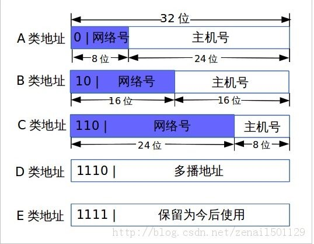
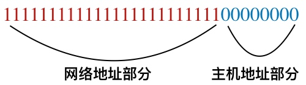
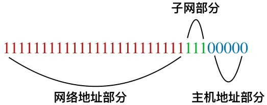

# 子网划分

原先搞过几年网络编程，自认为水平还不错，于是这种自信一直延续到现在。这几天项目中碰到一个偶现的网络问题，需要抓包从TCP协议层分析，突然发现已经把TCP的一些细节忘记了，不由感概岁月真是把杀猪刀……

于是简单把TCP的知识稍微回顾了一下，突然回想几年前一个朋友让我帮他出个子网划分的方案。然后又纠结了，早就记不起如何划分的。翻了翻技术笔记，还好方案有做记录，但划分的原理和过程却没有，不得已再查了查资料，就把这篇文章整理出来了。


## 什么是网关

了解子网划分之前需要知道网关的概念。

`网关是不同网络类型沟通的桥梁。`

也就是说不同的网络协议可以通过网关中间翻译的桥梁，从而实现互通。举个简单的例子：假设你在手机上安装了一个网络电话App，然后你通过网络电话打给你的朋友，但你的朋友没有安装这个App，但依然可以进行通话。原理就是在网络电话和传统电话两个不同的协议中间加一层网关进行沟通协调。

那么两个网络之间的通信需要有网关：

`A--A网关--B网关---B`

剩下的事情就是把不同网络的机器赋予不同的IP地址，再配置网关就可以了。

## IP地址的划分

#### IP地址格式

我们最常见的本地IP地址：`192.168.1.12`。

这是为了方便记忆，采用10进制区域分割的展示形式，实际IP地址的表示采用二进制，上面IP的十六进制表示为：`0xC0A8010C`，其中C0占用1个字节，对应的十进制值为192，A8是168，01是1，0C是12。

为了划分子网，就把IP地址分为两个组成部分：`网络地址`和`主机地址`。那么`192.168.1.12`哪部分是网络地址，哪部分又是主机地址呢？

这时候要用到`子网掩码`：用来指明IP哪部分是网络地址，哪部分是主机地址。我们经常使用的子网掩码一般是`255.255.255.0`，表示末尾是主机地址(0)，其他部分是网络地址(255.255.255)。这时候可能你已经有点晕，具体和IP是怎么样的对应关系？

用二进制方式来看IP和子网掩码的关系比较直观：

IP地址与子网掩码相与： 网络地址 

```
IP:  			0xC0 A8 01 0C
子网掩码：	0xFF FF FF 00
与操作(&)： ________________
网络地址：   0xC0 A8 01 
```

IP地址与子网掩码取反相与：主机地址

```
IP:  			 0xC0 A8 01 0C
子网掩码取反  0x00 00 00 FF
与操作(&)： ________________
主机地址：   0x         0C 
```

将网络地址用十进制表示就是`192.168.1`，主机地址：`12`。单看子网掩码的主机地址范围：`192.168.1.0----192.168.1.255`，网络地址范围应该是：`0.0.0.0----255.255.255.0`。


大家一看所谓`0.0.0.0`的IP肯定是不合法的，根据国际网络协议标准分为五类IP地址，常用的只有三类：`A、B、C`类地址，其中C类地址就是我们常见的局域网地址。



* A类地址空间为0-127，最大网络数为126，最大主机数为16,777,124；
* B类地址空间为128-191，最大网络数为16384，最大主机数为65,534；
* C类地址空间为192-223，最大网络数为2,097,152，最大主机数为254；

## 如何子网划分

通过IP的分类及子网掩码的协助，就可以给我们的局域网络进行子网络划分。划分的目的一个是防止广播风暴，一个是进行网络隔离（如不同子网的安全权限不同）。

我们知道内网与外网是相互独立的，中间通过NAT协议实现互通，从而解决IP资源不足的问题。那么内网划分我们采用哪种IP分类地址呢？既然是IP与外网相互独立的，所以三类地址选择哪种都可以。

如果子网的最大主机数不超过200台，采用C类地址就可以，A类和B类地址一般用户大型企业。

子网掩码的表示方式除了`255.255.255.0`之外，还有种表达方式：IP/`24`，这个24就是子网掩码。前面说255.255.255.0的十六进制是`0xFF FF FF 00`，对应的二进制是`11111111111111111111111100000000`，从左往右数1的个数，你会发现刚好是24（1是网络地址的掩码，0是主机地址的掩码）。



假设我们要对主机地址部分进行子网划分，则将主机一部分作为子网号，如`/27`：



其中绿色部分是子网划分号，二进制`111`的最大数为9，则意味着划分了就个子网。由于主机号从8位缩减到6位，最大主机数从原先的255-2变为32-2个（主机号不能全为0或全为1）。

```
ip地址子网段：
xxx.xxx.xxx.0 -- 21
xxx.xxx.xxx.32 -- 63
xxx.xxx.xxx.64 -- 95
xxx.xxx.xxx.96 -- 127
……
```

