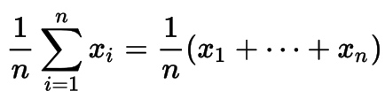
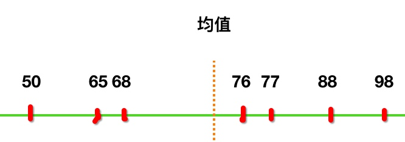
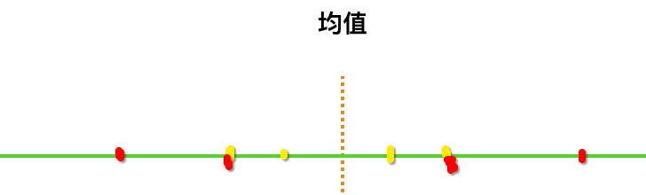

# 数学基础之--均值、方差

统计学中平均值有很多种，我们常说的平均值（算术平均值）其实叫均值。


## 均值

均值的概念很简单：一组数据中所有数据之和再除以这组数据的个数，数学公式：



> 好吧，我跟你一样看到数学公式就头疼，但要学机器学习还是要会的，我们从最简单的学起。

它的含义是什么呢？我们看下百度百科：`平均数代表一组数据集中趋势的量数`。你能明白什么意思吗？反正我看不明白。

举例说明：假如小明全年的数学成绩是[50, 76, 65, 88, 98, 68, 77]，现在让你衡量小明的数学水平，你会怎么做？你总不能把小明的所有成绩列出来吧。

噢，你已经想到了，采用均值（约等于75分）。那么均值的作用就是：`用来代表一组数据`，这有什么意义呢？

这太有意义了，数据分析和统计的目的不就是从一堆数据中找出能代表这堆数据的少数几个指标，并帮助我们做出决策吗。通过这种`代表一组数据`的特性，可以把大量数据转化为少量数据，依次递归最后得出结论。

好了，该用python求均值了：

```python
In [18]: l = [50, 76, 65, 88, 98, 68, 77]
In [19]: sum(l) / len(l)
Out[19]: 74.57142857142857
```

现在我们可以告诉别人，今年小明的数学成绩也就70多分。

等等，均值真有这么牛吗？我是说均值能真实代表小明的真实数学水平吗？我记得评分一般会去掉最高分和最低分（98分、50分）……

最后我们明确一下：

> 均值可以用来表征一组数据
> 均值表征这组数据的精确度我们暂不讨论


## 平均距离

通过上面小明的成绩[50, 76, 65, 88, 98, 68, 77]，用肉眼可以观察出小明考试发挥很不稳定。有时候稳定性很重要，比如上场打球，除了球打的好，你也希望自己的队友发挥稳定不是。

那么，如何让程序来判断出成绩的稳定性呢？

先来找找稳定性的规律，怎么才算稳定呢：`每次考试成绩都一样最稳定`。然后再观察其均值居然和每次的成绩都相等，太TM神奇了。看图：

均值和成绩重合了（假如每次都考89分）


再看看小明成绩与均值的关系：



说明什么？`说明成绩越稳定，所有成绩与均值之间的距离就越靠近`。

于是……我有个大胆的想法：计算所有成绩与均值之间的距离和，就能算出成绩的稳定性。当然，最好对距离和再求平均值（思考一下为什么？）。

直接上代码：

```python
l = [50, 76, 65, 88, 98, 68, 77]
total = 0
avg = sum(l) / len(l)
for i in l:
	total += i - avg
	
round(total/len(l))  ##因为算出的total是浮点数，所以使用round进行四舍五入
```

结果为0。什么情况？从上图可以看到，均值处于成绩中间，因此两边成绩与均值的距离刚好相等（否则就不是均值了😓）。

一个简单的办法可以使用绝对值求和`total += abs(i-avg)`，不过数学界有更好的方法解决这个问题：`方差`。


## 方差

方差和我们上述的平均距离唯一区别：`不是求距离的绝对值，而是平方`。平方解决了正负值的问题。

数学公式：


这次先上代码，再来理解方差的含义：

```python
l = [50, 76, 65, 88, 98, 68, 77]
total = 0
avg = sum(l) / len(l)
for i in l:
	total += (i - avg) ** 2   ##这里对距离求平方
	
round(total/len(l))  ##因为算出的total是浮点数，所以使用round进行四舍五入
```

方差主要的区别在与`平方`，我们画张图来理解一下方差的目的。

为了不分散注意力，假设有4个分数，距离均值等距，如下图：


再看下方差后的结果（黄点为原来位置，红点为平方后的位置）：



平方其实就是`放大效果`嘛，套用到均值距离，那就是：`离均值越近的值越不容易被影响，离均值越远的值成几何倍数远离均值`。

为了专业一点，将代码规整一下，写一个求方差的函数：

```python
def variance(l):
    avg = sum(l) / len(l)
    tmp = [(x-avg) ** 2 for x in l]
    return sum(tmp) / len(tmp)
```

现在我们用另一组数据来验证均值距离的优点：

```python
if __name__ == '__main__':
    print(variance(range(1, 10)))
    print(variance(range(51, 60)))
# output
# 6 #range(1, 10)的输出
# 6 #range(51, 60)的输出
```

可以看到均值距离和数据本身大小没有关系，只和数据与均值间的距离有关。

## 标准差

方差对距离进行了平方运算，标准差是对方差开平方，也就是把方差的放大行为又缩小回来。

```python
def standVariance(l):
    return variance(l) ** 0.5
```

这个太简单了。不过，这么折腾一圈，~~标准差比绝对值优秀在哪儿？着实让我很迷茫。~~

标准差比绝对值要优秀，举个小例子：

[-4,-4,4,4]采用绝对值和方差都为4，[-2,-6,1,7]明显比前者离散度高，但采用绝对值结果也为4，离散度与前者一样。但是采用方差的结果为4.74，也就是说方差比绝对值的离散度更精确。

什么原理呢？可参考两点间的距离公式，原理类似。


## 总结

均值：用来表征一组数据，也就是一个集体的代表。

标准差、方差：用来计算一组数据的分散性或聚合程度。两者之间的区别，标准差较为真实反应分数程度，方差夸大分散程度（方差等于标准差的平方）。


