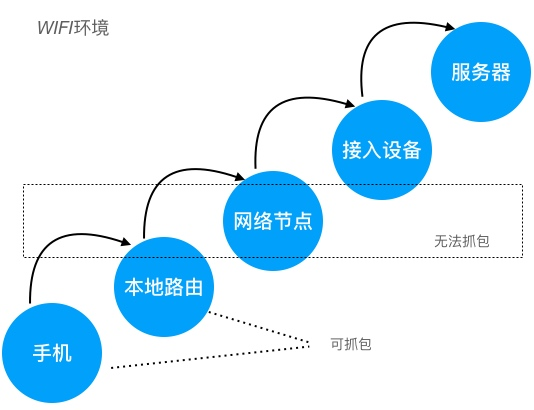
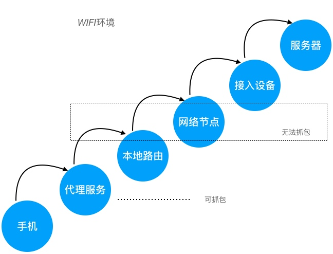
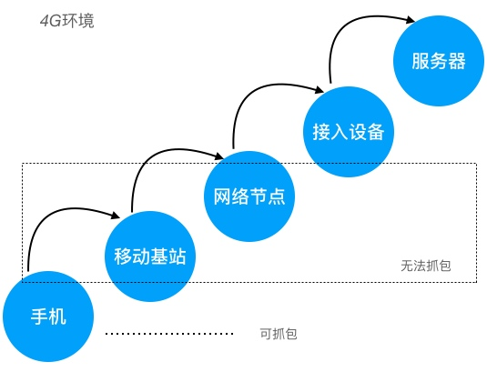
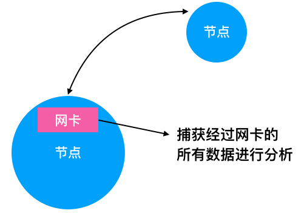
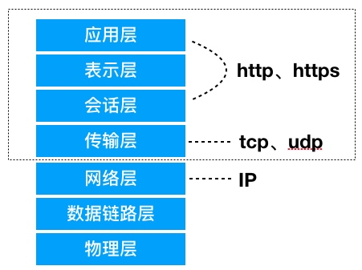
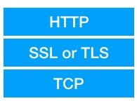
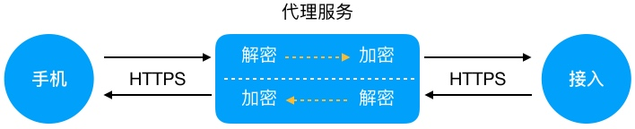
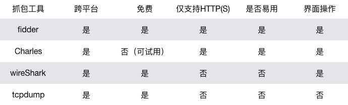

# 网络抓包原理及常用抓包工具

本文以App作为例子，实际应用不限于App范围。 

## 1. 为什么要抓包 

1. 定位网络接口问题
2. 分析其他App数据接口 
3. 学习网络协议，使用抓包工具分析网络数据更直观

大部分场合都可以通过程序调试来定位问题，但有些场景使用抓包来定位接口问题更准确、更方便，如以下场景：

* 你发送数据给后台，但后台没有收到，可以对接口进行抓包分析，看是后台处理有问题，还是App没有将数据发出去，或是App发送数据格式有误
* 你和后台接口联调测通，但业务数据对不上，你认为是后台问题，后台认为是你发的问题，可以抓包确认问题所在
* 线上App出现bug需要定位，但你没在公司，没有代码可调试，可直接抓包分析
* App页面渲染缓慢，抓包看下接口响应时长，是不是后台出现性能问题
* 需要测试弱网环境下App的体验？抓包工具可设置流量限制，可设置接口堵塞
* 想改变某接口的响应报文？想多次重发某一请求，但App业务流程有限制？可以试试抓包工具提供的功能

## 2. 网络抓包原理 

要实现对App的网络数据抓包，需要监控App与服务器交互之间的网络节点，监控其中任意一个网络节点（网卡），获取所有经过网卡中的数据，对这些数据按照网络协议进行解析，这就是抓包的基本原理。

但是中间网络节点，不受我们控制，所以基本无法实现抓包的，只能在客户端和服务端进行抓包。

通常我们监控本地网卡数据，如下图：

> 手机、本地网络属于客户端侧的抓包，接入设备、服务器属于后台侧的抓包，两者没有什么不同

`本地网络`指的是WIFI的路由，如果直接抓路由器的包还是比较麻烦的，因此我们会在`手机`和`本地路由`之间加一层`代理服务`，这样只要抓代理服务的网络数据即可：

虽然在`手机`侧也可实现抓包，但和`本地路由`一样，抓包比较麻烦，如果不是没有办法，尽量还是不在手机侧抓包。但是有一种情况必须在手机端抓包，那就是在4G网络情况下：

4G网络状态下如何抓包，以及它的劣势，我们后面章节再细讲。

除了通过代理，直接利用网卡驱动捕获所有流经网卡的数据：

这样的好处是不用设置代理，但它的缺点也很明显，只能对数据进行分析，无法进一步的控制。

例如无法解析https报文（除非有https整数）；无法篡改报文数据等。

## 3. 网络协议

抓包实际上是分析网络协议的一种过程，尽管繁琐的细节劳动都让抓包工具做了，但我们还是需要了解下基础的网络协议，好帮助我们更好的分析问题。

首先需要了解下经典的OSI七层网络模型，以及每层的作用，其次对TCP、HTTP协议简单了解。

> 虚线框中的部分是需要着重了解的。

#### HTTPS与HTTP有什么不同？

HTTPS是基于HTTP协议的一种改进，在`TCP之上`的会话层增加安全处理。对于应用层来说，HTTPS和HTTP没有什么不同，也就是说，HTTPS是保证网络传输的安全性，对业务数据无侵入。

简化理解大概是这个样子：

SSL和TLS是保证安全传输的协议，包括证书认证、加解密和数字签名。

项目中HTTPS的链路：

因此，客户端与后台，编写网络接口时，不需要关心SSL或TLS，按照HTTP协议处理即可。

既然HTTPS在网络传输是经过加密的，那么抓包抓到的数据就是密文，不经过解密是无法看到报文的。针对这个问题，如上图WIFI环境下设置代理的方式可以解决，具体思路是：

所以整个网络链路依然是HTTPS在传输，但代理服务自己可以获取到明文数据。

## 4. 常用抓包工具

比较常用的抓包工具大概有4个，主要用作互补，配合使用基本所有平台、所有抓包需求都能满足：

* fidder  windows平台最受欢迎抓包工具，免费、易用
* charles  Mac平台下最佳抓包工具，易于使用，收费软件，可一直试用
* wireShark  老牌抓包工具，跨平台，功能齐全、强大
* tcpdump  命令行程序，适用于手机系统和后台系统

`需要说明的是，tcpdump可将数据保存成文件，直接用wireShark打开分析，针对后台或手机抓包使用起来十分方便。`

> fidder、charles属于代理类的抓包工具

> wireShark、tcpdump属于网卡抓包工具

几个工具间的使用关系：

1. 如果是windows平台，使用fidder
2. 如果是Mac平台，使用charles
3. 如果是linux平台(手机或后台)，使用tcpdump
4. 如果抓非HTTP(S)协议的包，如TCP包，则使用wireShark

#### 4.1 tcpdump命令

抓去所有网络接口的数据，并保存到当前目录的capture.pcap文件中：

tcpdump -p -vv -s 0 -i any -w capture.pcap

* -p 关闭混合模式
* -vv 产生更详细的输出
* -s 0 抓去完整的数据包
* -i any 监听任意网络接口
* -w 将抓去的包保存文件

> 混合模式，即可以监听所有经过该网卡的数据（关闭混合模式可以过滤掉一些垃圾数据）

## 5. 真机抓包

为什么要真机抓包？必定是没有办法设置代理服务了，如4G网络情况下直接和移动基站链接，没法设置代理服务。凡是非4G网络状态下，都不建议真机抓包。

#### 5.1 iOS真机抓包

iOS 5后，apple引入了RVI remote virtual interface的特性，它只需要将iOS设备使用USB数据线连接到mac上，然后使用rvictl工具以iOS设备的UDID为参数在Mac中建立一个虚拟网络接口rvi，就可以在mac设备上使用tcpdump，wireshark等工具对创建的接口进行抓包分析。

具体步骤：

1. 获得iOS设备的UDID
2. 使用USB数据线将iOS设备和MAC连接
3. 创建RVI接口 `rvictl -s <UDID>`
4. 使用wireShark抓取`rvi0`虚拟接口
5. 移除RVI接口 `rvictl -x <UDID>`

> 真机抓包，意味着无法获取HTTPS的明文数据，因此真机抓包的意义不大，只能用户分析网络接口连通性，正确性，无法分析业务报文是否正确。

#### 5.2 android真机抓包

android是linux系统，和后台一样可以使用tcpdump命令来抓包，但是需要root权限，因为一般手机系统不带有抓包命令`tcpdump`，需要自行安装。

安装tcpdump：

1. 下载android版本的[tcpdump](https://www.androidtcpdump.com)
2. adb shell
3. su #切换root用户
4. chmod 777 /data/local  #修改目标路径权限，这里是/data/local
5. adb push tcpdump /data/local #将tcpdump拷贝到目标路径

> 若tcpdump命令不能执行，需要赋予该文件chmod +x tcpdump

使用tcpdump：

1. adb shell
2. su
3. /data/local/tcpdump -p -vv -s 0 -i any -w /data/local/capture.pcapng

这是就已经进入抓包状态，手机所有的网络请求都会被捕获，并保存到capture文件中。

导出capture文件：

1. adb pull /data/local/capture.pcapng .  #导出到当前目录
2. 使用wireShark打开capture文件，进行浏览分析

> 若进行push及pull操作不成功，可能是因为不让直接操作/data/local等系统目录，可以先pull到sd卡，在将文件从sd卡拷贝到/data/local，反之依然。

