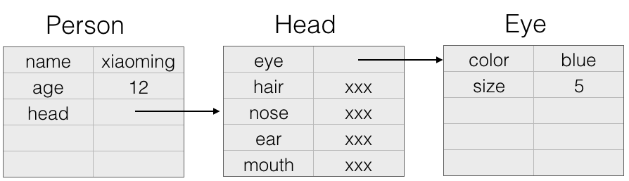
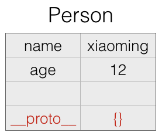
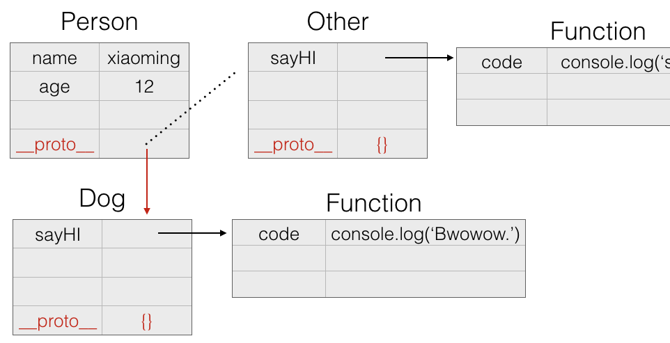

# 理解javascript对象、Function和原型

## 概述

* javascript中最难理解概念是对象、Function和原型，只要理解了这几个核心概念，基本就算入门了。javascript中没有类，这无疑给很多静态类型语言者设立了一道不小的门槛。
* 软件设计过程中，把计算机语言抽象成现实世界的物体和对象，有助于我们理解和使用，下面我们就尝试用某种方式去理解javascript。

## javascript的对象和原型组合起来是什么？

答案：表格。

是的，你没有看错，就是表格。下来我们一步步使用表格去描绘javascript的世界。

## javascript中的对象

javascript中不都是对象，还有基本数据类型，对象呢，就是由基本数据类型和对象组成的复合对象。
先来看看一个简单对象的表格表示：

	//对象
	var Person = {
		name: "xiaoming",
		age: 12
	}	

这个对象比较简单，成员都是基本数据类型，下来增加一个对象成员：

	var Person = {
		name: "xiaoming",
		age: 12,
		head: {
			eye: {
				color: blue,
				size: 5
			},
			hair: xxx,
			nose: xxx,
			ear: xxx,
			mouth: xxx
		}
	}

现在再看，是不是已经有点儿意思了，我们继续……

现在给对象加上成员函数：

	var Person = {
		name: "xiaoming",
		age: 12,
		head: {
			eye: {
				color: blue,
				size: 5
			},
			hair: xxx,
			nose: xxx,
			ear: xxx,
			mouth: xxx
		},
	
		print: function() {
			console.log('this is Person print.');
		}
	}

这里对成员方法的表示不太严谨，我是把方法和属性归为同样的方式去理解，这样更简单些。毕竟我们抽象的目的是为了理解语言，而不是按照规范去描述语言。

#### 把方法单独抽取出来，是因为在javascript中，函数可以绑定或作用到其他对象上。

## Function和对象的关系

javascript中Function也是对象，是特殊的一种对象，理解起来有些困难，但是转换下思维，用我们的表格去表达，会很简单有趣。

	function Person() {
	
		this.name = "xiaoming";
		this.age = 12;
		this.head = {
	
			eye: {
				color: blue,
				size: 5
			},
			hair: xxx,
			nose: xxx,
			ear: xxx,
			mouth: xxx
		}
	
		this.print = function() {
			console.log('this is Person print.');
		}
	}

由上图可以看出，Function也是一个对象，和普通对象的区别在于：Function有一个默认的构造函数，当创建这个对象时，通过这个构造函数去创建对象。

## 原型和javascript中的继承

原型的概念在javascript中也是难于理解的知识点，我们看看如何用简单的方法理解复杂的概念。

* 每个javascript对象都有一个默认属性`__proto__`，它值是一个对象，这个属性由javascript解释器自动生成，默认为空对象{}。
* `__proto__`的作用是方法的遍历查找。执行某对象的方法而该对象没有定义该方法时，则从`__proto__`指向的对象中继续查找该方法。
* `__proto__`运行时用户可修改。

为了更直观的观察效果，我们先回到最初的事例：

	var Person = {
		name: "xiaoming",
		age: 12
	}

实际运行时该对象多了一个隐含属性：`__proto__`，之前说了，该属性可修改，也就是我们可动态修改该属性的值。

	var Person = {
		name: "xiaoming",
		age: 12
	}
	
	//定义另一个对象，该对象有一个方法sayHI.
	var Other = {
		sayHI: function() {
			console.log('say hi.');
		}
	}
	
	Person.__proto__ = Other;
	Person.sayHI();  //输出：say hi.

上面的代码，我们修改了Person对象的原型，指向了Other对象，然后执行`Person.sayHI()`，依然可以正确输出。

这已然间接实现了继承特性，但，还远不止这些，继续往下看：

	var Dog = {
		sayHI: function() {
			console.log('Bwowow');
		}
	}
	
	Person.__proto__ = Dog;
	Person.sayHI();  //输出：Bwowow.

好了，我们在运行时可以动态改变对象的`__proto__`，也就动态的改变了对象的执行能力。很可怕吧，动态语言一般都具备运行时改变对象的能力，给你更灵活的变化，写出更简洁优雅的代码。运行时修改是把双刃剑，动态和静态编译是颇有争议的话题，这里不讨论。

##结论
到这里就差不多了，这里只是提出一个理解javascript的思路，抛砖引玉，按照这种方式理解，那么应该会很快掌握javascript的核心概念，当然，既然是抽象，肯定就有不完备之处。当初之所以这么理解，是因为个人更喜欢站在语言实现的角度考虑问题，希望没有误人子弟。

